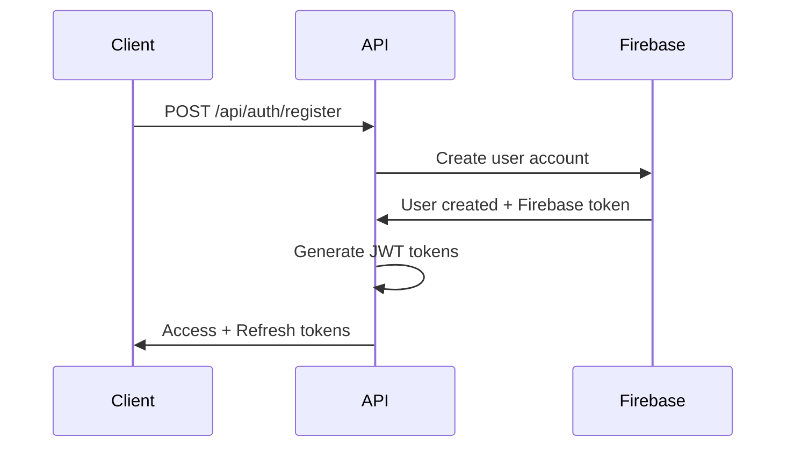
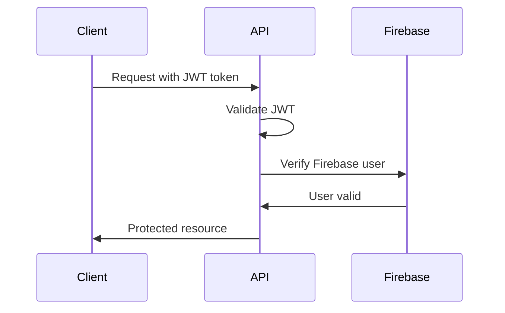

# Trego Backend API Documentation

## Base URL
All API endpoints are prefixed with `/api` as configured in `application.yml`.

**Development**: `http://localhost:8080/api`
**Production**: `https://your-domain.com/api`

## Authentication

The API uses Firebase Authentication combined with JWT tokens for session management. All authenticated endpoints require the `Authorization` header with a Bearer token.

### Headers
```
Authorization: Bearer <jwt_token>
Content-Type: application/json
```

---

## Authentication Endpoints

### 1. Register New User
**POST** `/api/auth/register`

Register a new user account with email and password.

**Request Body:**
```json
{
  "email": "user@example.com",
  "password": "securePassword123",
  "firstName": "John",
  "lastName": "Doe",
  "phoneNumber": "+1234567890"
}
```

**Response (201 Created):**
```json
{
  "success": true,
  "message": "User registered successfully",
  "data": {
    "userId": "firebase_user_id",
    "email": "user@example.com",
    "firstName": "John",
    "lastName": "Doe",
    "emailVerified": false,
    "accessToken": "jwt_access_token",
    "refreshToken": "jwt_refresh_token",
    "expiresIn": 86400000
  }
}
```

**Error Responses:**
- `400 Bad Request`: Invalid input data or email already exists
- `500 Internal Server Error`: Firebase or server error

---

### 2. User Login
**POST** `/api/auth/login`

Authenticate user and return access tokens.

**Request Body:**
```json
{
  "email": "user@example.com",
  "password": "securePassword123"
}
```

**Response (200 OK):**
```json
{
  "success": true,
  "message": "Login successful",
  "data": {
    "userId": "firebase_user_id",
    "email": "user@example.com",
    "firstName": "John",
    "lastName": "Doe",
    "emailVerified": true,
    "accessToken": "jwt_access_token",
    "refreshToken": "jwt_refresh_token",
    "expiresIn": 86400000,
    "lastLogin": "2023-12-01T10:30:00.000Z"
  }
}
```

**Error Responses:**
- `401 Unauthorized`: Invalid credentials
- `403 Forbidden`: Account disabled or email not verified
- `400 Bad Request`: Invalid input format

---

### 3. Firebase User Sync
**POST** `/api/auth/firebase-sync`

Sync an existing Firebase user with the backend system.

**Request Headers:**
```
Authorization: Bearer <firebase_id_token>
```

**Request Body:**
```json
{
  "firebaseToken": "firebase_id_token"
}
```

**Response (200 OK):**
```json
{
  "success": true,
  "message": "Firebase user synced successfully",
  "data": {
    "userId": "firebase_user_id",
    "email": "user@example.com",
    "accessToken": "jwt_access_token",
    "refreshToken": "jwt_refresh_token",
    "profile": {
      "firstName": "John",
      "lastName": "Doe",
      "preferences": {}
    }
  }
}
```

---

### 4. Refresh Access Token
**POST** `/api/auth/refresh`

Get a new access token using refresh token.

**Request Body:**
```json
{
  "refreshToken": "jwt_refresh_token"
}
```

**Response (200 OK):**
```json
{
  "success": true,
  "message": "Token refreshed successfully",
  "data": {
    "accessToken": "new_jwt_access_token",
    "refreshToken": "new_jwt_refresh_token",
    "expiresIn": 86400000
  }
}
```

**Error Responses:**
- `401 Unauthorized`: Invalid or expired refresh token
- `403 Forbidden`: Refresh token revoked

---

### 5. Get Current User
**GET** `/api/auth/me`

Get authenticated user's profile information.

**Headers:**
```
Authorization: Bearer <jwt_token>
```

**Response (200 OK):**
```json
{
  "success": true,
  "data": {
    "userId": "firebase_user_id",
    "email": "user@example.com",
    "firstName": "John",
    "lastName": "Doe",
    "phoneNumber": "+1234567890",
    "emailVerified": true,
    "createdAt": "2023-11-01T10:00:00.000Z",
    "updatedAt": "2023-12-01T10:30:00.000Z",
    "profile": {
      "fitnessGoals": ["weight_loss", "muscle_gain"],
      "activityLevel": "moderate",
      "preferences": {
        "units": "metric",
        "notifications": {
          "workouts": true,
          "nutrition": true,
          "social": false
        }
      }
    }
  }
}
```

---

### 6. Verify Email Address
**POST** `/api/auth/verify-email`

Verify user's email address using verification code.

**Request Body:**
```json
{
  "email": "user@example.com",
  "verificationCode": "123456"
}
```

**Response (200 OK):**
```json
{
  "success": true,
  "message": "Email verified successfully",
  "data": {
    "emailVerified": true,
    "verifiedAt": "2023-12-01T10:30:00.000Z"
  }
}
```

---

### 7. Forgot Password
**POST** `/api/auth/forgot-password`

Send password reset email to user.

**Request Body:**
```json
{
  "email": "user@example.com"
}
```

**Response (200 OK):**
```json
{
  "success": true,
  "message": "Password reset email sent",
  "data": {
    "email": "user@example.com",
    "resetTokenSent": true
  }
}
```

---

### 8. Reset Password
**POST** `/api/auth/reset-password`

Reset user password using reset token.

**Request Body:**
```json
{
  "email": "user@example.com",
  "resetToken": "reset_token_from_email",
  "newPassword": "newSecurePassword123"
}
```

**Response (200 OK):**
```json
{
  "success": true,
  "message": "Password reset successfully",
  "data": {
    "passwordResetAt": "2023-12-01T10:30:00.000Z"
  }
}
```

---

### 9. Logout User
**POST** `/api/auth/logout`

Logout user and invalidate tokens.

**Headers:**
```
Authorization: Bearer <jwt_token>
```

**Request Body:**
```json
{
  "refreshToken": "jwt_refresh_token"
}
```

**Response (200 OK):**
```json
{
  "success": true,
  "message": "Logout successful",
  "data": {
    "loggedOut": true,
    "tokensRevoked": true
  }
}
```

---

### 10. Update User Profile
**PUT** `/api/auth/profile`

Update user's profile information.

**Headers:**
```
Authorization: Bearer <jwt_token>
```

**Request Body:**
```json
{
  "firstName": "John",
  "lastName": "Smith",
  "phoneNumber": "+1234567890",
  "profile": {
    "fitnessGoals": ["weight_loss", "strength"],
    "activityLevel": "high",
    "height": 175,
    "weight": 70,
    "dateOfBirth": "1990-05-15",
    "preferences": {
      "units": "metric",
      "notifications": {
        "workouts": true,
        "nutrition": true,
        "social": false
      },
      "privacy": {
        "shareWorkouts": true,
        "shareProgress": false
      }
    }
  }
}
```

**Response (200 OK):**
```json
{
  "success": true,
  "message": "Profile updated successfully",
  "data": {
    "userId": "firebase_user_id",
    "firstName": "John",
    "lastName": "Smith",
    "phoneNumber": "+1234567890",
    "updatedAt": "2023-12-01T10:30:00.000Z",
    "profile": {
      "fitnessGoals": ["weight_loss", "strength"],
      "activityLevel": "high",
      "height": 175,
      "weight": 70,
      "bmi": 22.9,
      "preferences": {
        "units": "metric",
        "notifications": {
          "workouts": true,
          "nutrition": true,
          "social": false
        }
      }
    }
  }
}
```

---

### 11. Delete Account
**DELETE** `/api/auth/account`

Permanently delete user account and all associated data.

**Headers:**
```
Authorization: Bearer <jwt_token>
```

**Request Body:**
```json
{
  "password": "currentPassword123",
  "confirmDeletion": true
}
```

**Response (200 OK):**
```json
{
  "success": true,
  "message": "Account deleted successfully",
  "data": {
    "deletedAt": "2023-12-01T10:30:00.000Z",
    "accountDeleted": true
  }
}
```

---

## Health & Monitoring Endpoints

### 1. Application Health
**GET** `/actuator/health`

Check overall application health status.

**Response (200 OK):**
```json
{
  "status": "UP",
  "components": {
    "firebase": {
      "status": "UP",
      "details": {
        "projectId": "trego-app",
        "connected": true
      }
    },
    "diskSpace": {
      "status": "UP",
      "details": {
        "total": 499963174912,
        "free": 91462209536,
        "threshold": 10485760,
        "path": "/Users/osahumenaghasomwan/trego_backend/."
      }
    }
  }
}
```

---

### 2. Application Information
**GET** `/actuator/info`

Get application build and configuration information.

**Response (200 OK):**
```json
{
  "app": {
    "name": "Trego Backend",
    "version": "1.0.0",
    "description": "Trego fitness app backend API"
  },
  "build": {
    "artifact": "trego-backend",
    "name": "Trego Backend",
    "time": "2023-12-01T10:30:00.000Z",
    "version": "1.0.0"
  },
  "java": {
    "version": "17.0.8",
    "vendor": {
      "name": "Eclipse Adoptium"
    }
  }
}
```

---

### 3. Application Metrics
**GET** `/actuator/metrics`

Get list of available application metrics.

**Response (200 OK):**
```json
{
  "names": [
    "application.ready.time",
    "application.started.time",
    "disk.free",
    "disk.total",
    "executor.active",
    "executor.completed",
    "executor.pool.core",
    "executor.pool.max",
    "executor.pool.size",
    "executor.queue.remaining",
    "executor.queued",
    "http.server.requests",
    "jvm.buffer.count",
    "jvm.buffer.memory.used",
    "jvm.buffer.total.capacity",
    "jvm.classes.loaded",
    "jvm.classes.unloaded",
    "jvm.gc.live.data.size",
    "jvm.gc.max.data.size",
    "jvm.gc.memory.allocated",
    "jvm.gc.memory.promoted",
    "jvm.gc.overhead",
    "jvm.gc.pause",
    "jvm.memory.committed",
    "jvm.memory.max",
    "jvm.memory.used",
    "jvm.threads.daemon",
    "jvm.threads.live",
    "jvm.threads.peak",
    "logback.events",
    "process.cpu.usage",
    "process.start.time",
    "process.uptime",
    "system.cpu.count",
    "system.cpu.usage",
    "tomcat.sessions.active.current",
    "tomcat.sessions.active.max",
    "tomcat.sessions.alive.max",
    "tomcat.sessions.created",
    "tomcat.sessions.expired",
    "tomcat.sessions.rejected"
  ]
}
```

---

### 4. Prometheus Metrics
**GET** `/actuator/prometheus`

Get metrics in Prometheus format for monitoring.

**Response (200 OK):**
```
# HELP application_ready_seconds Time taken (ms) for the application to be ready to service requests
# TYPE application_ready_seconds gauge
application_ready_seconds{main_class="com.trego.TregoApplication"} 2.514
# HELP application_started_seconds Time taken (ms) to start the application
# TYPE application_started_seconds gauge
application_started_seconds{main_class="com.trego.TregoApplication"} 2.459
# HELP disk_free_bytes Usable space for path
# TYPE disk_free_bytes gauge
disk_free_bytes{path="/Users/osahumenaghasomwan/trego_backend/."} 9.1462209536E10
# HELP disk_total_bytes Total space for path
# TYPE disk_total_bytes gauge
disk_total_bytes{path="/Users/osahumenaghasomwan/trego_backend/."} 4.99963174912E11
```

---

## Request/Response Formats

### Standard Success Response
```json
{
  "success": true,
  "message": "Operation completed successfully",
  "data": {
    // Response data specific to the endpoint
  },
  "timestamp": "2023-12-01T10:30:00.000Z"
}
```

### Standard Error Response
```json
{
  "success": false,
  "error": {
    "code": "ERROR_CODE",
    "message": "Human readable error message",
    "details": "Additional error details if available"
  },
  "timestamp": "2023-12-01T10:30:00.000Z",
  "path": "/api/auth/login"
}
```

---

## Rate Limiting

The API implements rate limiting using bucket4j:
- **Default**: 60 requests per minute per IP
- **Burst**: Up to 10 additional requests
- **Headers**: Rate limit information included in response headers

**Rate Limit Headers:**
```
X-RateLimit-Limit: 60
X-RateLimit-Remaining: 45
X-RateLimit-Reset: 1701429600
```

---

## Authentication Flow

### 1. Registration/Login Flow


### 2. Authenticated Request Flow


---

## Data Models

### User Model
```json
{
  "userId": "string",
  "email": "string",
  "firstName": "string",
  "lastName": "string",
  "phoneNumber": "string",
  "emailVerified": "boolean",
  "createdAt": "ISO 8601 timestamp",
  "updatedAt": "ISO 8601 timestamp",
  "lastLogin": "ISO 8601 timestamp"
}
```

### User Profile Model
```json
{
  "userId": "string",
  "fitnessGoals": ["weight_loss", "muscle_gain", "endurance", "strength"],
  "activityLevel": "sedentary | low | moderate | high | very_high",
  "height": "number (cm)",
  "weight": "number (kg)",
  "dateOfBirth": "ISO 8601 date",
  "gender": "male | female | other",
  "medicalConditions": ["string"],
  "preferences": {
    "units": "metric | imperial",
    "timezone": "string",
    "notifications": {
      "workouts": "boolean",
      "nutrition": "boolean",
      "social": "boolean",
      "reminders": "boolean"
    },
    "privacy": {
      "shareWorkouts": "boolean",
      "shareProgress": "boolean",
      "shareNutrition": "boolean"
    }
  },
  "createdAt": "ISO 8601 timestamp",
  "updatedAt": "ISO 8601 timestamp"
}
```

---

## Error Codes

### Authentication Errors
- `AUTH_001`: Invalid credentials
- `AUTH_002`: Account disabled
- `AUTH_003`: Email not verified
- `AUTH_004`: Token expired
- `AUTH_005`: Invalid token format
- `AUTH_006`: User not found
- `AUTH_007`: Email already exists

### Validation Errors
- `VAL_001`: Required field missing
- `VAL_002`: Invalid email format
- `VAL_003`: Password too weak
- `VAL_004`: Invalid phone number
- `VAL_005`: Invalid date format

### Firebase Errors
- `FB_001`: Firebase connection failed
- `FB_002`: Firebase authentication failed
- `FB_003`: Firestore operation failed
- `FB_004`: Firebase storage error

### External API Errors
- `EXT_001`: OpenAI API error
- `EXT_002`: Stripe payment error
- `EXT_003`: Email service error

---

## Testing Examples

### cURL Examples

**Register User:**
```bash
curl -X POST http://localhost:8080/api/auth/register \
  -H "Content-Type: application/json" \
  -d '{
    "email": "test@example.com",
    "password": "securePassword123",
    "firstName": "Test",
    "lastName": "User"
  }'
```

**Login:**
```bash
curl -X POST http://localhost:8080/api/auth/login \
  -H "Content-Type: application/json" \
  -d '{
    "email": "test@example.com",
    "password": "securePassword123"
  }'
```

**Get Current User:**
```bash
curl -X GET http://localhost:8080/api/auth/me \
  -H "Authorization: Bearer YOUR_JWT_TOKEN"
```

**Check Health:**
```bash
curl http://localhost:8080/actuator/health
```

---

## Development Environment Setup

### Prerequisites
1. Firebase project configured with Authentication and Firestore
2. Service account key placed at `config/firebase-credentials.json`
3. Environment variables configured (see README.md)

### Quick Start
```bash
# Ensure Firebase credentials exist
ls config/firebase-credentials.json

# Start the application
./mvnw spring-boot:run

# Test basic endpoint
curl http://localhost:8080/actuator/health
```

### Environment Variables for Development
```bash
export FIREBASE_PROJECT_ID="your-firebase-project"
export JWT_SECRET="your-256-bit-secret-key"
export OPENAI_API_KEY="sk-your-openai-key"
export STRIPE_SECRET_KEY="sk_test_your-stripe-key"
```