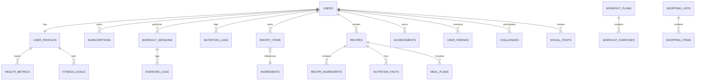

Trego Fitness Backend Architecture & Implementation📋 Table of Contents
# Backend Architecture Plan
# Enhanced Database Schema
# Production-Ready Code
# API Design
# Integration Guide
# Monetization Hooks

🏗️ Backend Architecture PlanSystem Overview
# Trego Fitness Backend Architecture

## 🏗️ System Architecture Overview

```
┌─────────────────────────────────────────────────────────────────┐
│                        CLIENT LAYER                             │
├─────────────────────────────────────────────────────────────────┤
│  Flutter Mobile App  │  Web Dashboard  │  Admin Panel          │
└─────────────────────────────────────────────────────────────────┘
                               │
                    ┌──────────▼──────────┐
                    │   API Gateway       │
                    │   (Spring Cloud)    │
                    └──────────┬──────────┘
                               │
        ┌──────────────────────┼──────────────────────┐
        │                      │                      │
┌───────▼─────────┐   ┌────────▼────────┐   ┌────────▼────────┐
│   Auth Service  │   │  Core API       │   │  AI Service     │
│   (Firebase)    │   │  (Spring Boot)  │   │  (OpenAI/GPT)   │
└─────────────────┘   └─────────────────┘   └─────────────────┘
                               │
        ┌──────────────────────┼──────────────────────┐
        │                      │                      │
┌───────▼─────────┐   ┌────────▼────────┐   ┌────────▼────────┐
│  Workout Engine │   │  Recipe Engine  │   │  Notification   │
│                 │   │                 │   │  Service        │
└─────────────────┘   └─────────────────┘   └─────────────────┘
                               │
        ┌──────────────────────┼──────────────────────┐
        │                      │                      │
┌───────▼─────────┐   ┌────────▼────────┐   ┌────────▼────────┐
│  Data Layer     │   │  Cache Layer    │   │  External APIs  │
│  (Firebase +    │   │  (Redis)        │   │  (Maps, Health) │
│   PostgreSQL)   │   │                 │   │                 │
└─────────────────┘   └─────────────────┘   └─────────────────┘
```

## 🔧 Core Services Architecture

### 1. Authentication & Authorization Service
- **Firebase Authentication** for user management
- **JWT tokens** with refresh mechanism
- **Role-based access control** (Free, Premium, Admin)
- **OAuth integration** (Google, Apple, Facebook)

### 2. User Management Service
- User profiles and preferences
- Health metrics (TDEE, BMI, body composition)
- Goal tracking and milestone management
- Social features (friends, challenges)

### 3. Recipe & Nutrition Engine
- **AI-powered recipe generation** via OpenAI/GPT
- Nutritional analysis and macro calculations
- Recipe recommendations based on preferences/goals
- Meal planning and shopping list generation

### 4. Pantry & Inventory Management
- Smart pantry tracking with expiry dates
- Barcode scanning integration
- Usage analytics and waste reduction
- Auto-generated shopping lists

### 5. Workout & Fitness Tracking
- Exercise library with video demonstrations
- AI workout plan generation
- GPS-based route tracking
- Integration with wearables (Apple Health, Google Fit)

### 6. AI Coach & Analytics Engine
- Progress analysis and pattern recognition
- Personalized recommendations
- Adaptive goal setting
- Performance predictions

### 7. Notification & Engagement Service
- Push notifications (workout reminders, meal prep)
- In-app messaging and coaching tips
- Streak tracking and gamification
- Achievement system

## 🛠️ Technology Stack

### Backend Framework
- **Spring Boot 3.2+** - Main application framework
- **Spring Security** - Authentication and authorization
- **Spring Data JPA** - Database abstraction
- **Spring Cloud Gateway** - API gateway and routing

### Database Strategy
- **Firebase Firestore** - Real-time data, user profiles, social features
- **PostgreSQL** - Complex queries, analytics, reporting
- **Redis** - Caching, session management, rate limiting

### AI & Machine Learning
- **OpenAI GPT-4** - Recipe generation and coaching
- **TensorFlow Lite** - On-device ML for habit prediction
- **Custom ML models** - Nutrition analysis, workout optimization

### Infrastructure
- **Docker & Kubernetes** - Containerization and orchestration
- **Google Cloud Platform** - Hosting and services
- **Firebase** - Real-time features and authentication
- **CloudFlare** - CDN and DDoS protection

### Monitoring & Observability
- **Prometheus** - Metrics collection
- **Grafana** - Monitoring dashboards
- **ELK Stack** - Logging and analysis
- **Jaeger** - Distributed tracing

## 📊 Data Flow Architecture

```
User Action → API Gateway → Authentication → Service Router → Business Logic → Data Layer → AI Processing → Response
```

### Real-time Features
- WebSocket connections for live workout tracking
- Server-sent events for notifications
- Firebase real-time database for social features

### Batch Processing
- Daily TDEE calculations
- Weekly progress reports
- Monthly analytics and insights
- Recipe recommendation updates

## 🔒 Security Architecture

### Authentication Flow
1. User authenticates via Firebase Auth
2. Custom JWT tokens issued with role claims
3. Token validation on each API request
4. Role-based endpoint access control

### Data Protection
- End-to-end encryption for sensitive data
- GDPR compliance with data anonymization
- Secure API communication (HTTPS/TLS 1.3)
- Rate limiting and DDoS protection

### Privacy Controls
- User data export functionality
- Granular privacy settings
- Consent management system
- Audit logging for data access

## 📈 Scalability Strategy

### Horizontal Scaling
- Microservices architecture
- Load balancing with auto-scaling
- Database sharding strategies
- CDN for static content delivery

### Performance Optimization
- Redis caching layers
- Database query optimization
- Async processing for heavy operations
- Connection pooling and resource management

### Global Distribution
- Multi-region deployment
- Data locality compliance
- Edge computing for AI inference
- Progressive web app capabilities


🗄️ Enhanced Database Schema
# Trego Fitness Database Schema

## 🏗️ Database Architecture Strategy

### Hybrid Database Approach
- **Firebase Firestore**: Real-time features, user profiles, social data
- **PostgreSQL**: Complex analytics, reporting, ML training data
- **Redis**: Caching, sessions, real-time counters

## 📊 Core Entity Relationship Diagram



## 🔥 Firebase Firestore Collections

### Users Collection
```json
{
  "users": {
    "userId": {
      "email": "string",
      "displayName": "string",
      "photoURL": "string",
      "phoneNumber": "string",
      "emailVerified": "boolean",
      "provider": "string",
      "createdAt": "timestamp",
      "lastLoginAt": "timestamp",
      "isActive": "boolean",
      "subscriptionTier": "enum[free,premium,pro]",
      "preferences": {
        "language": "string",
        "timezone": "string",
        "units": "enum[metric,imperial]",
        "notifications": {
          "workouts": "boolean",
          "meals": "boolean",
          "social": "boolean",
          "marketing": "boolean"
        }
      }
    }
  }
}
```

### User Profiles Collection
```json
{
  "userProfiles": {
    "userId": {
      "personalInfo": {
        "firstName": "string",
        "lastName": "string",
        "dateOfBirth": "date",
        "gender": "enum[male,female,other]",
        "height": "number",
        "currentWeight": "number",
        "targetWeight": "number"
      },
      "fitnessProfile": {
        "activityLevel": "enum[sedentary,lightly_active,moderately_active,very_active,extra_active]",
        "experience": "enum[beginner,intermediate,advanced]",
        "primaryGoals": ["string"],
        "workoutPreferences": {
          "frequency": "number",
          "duration": "number",
          "preferredTime": "string",
          "equipment": ["string"],
          "workoutTypes": ["string"]
        }
      },
      "nutritionProfile": {
        "dietaryRestrictions": ["string"],
        "allergies": ["string"],
        "cuisinePreferences": ["string"],
        "mealPrepPreference": "enum[none,basic,advanced]",
        "cookingSkillLevel": "enum[beginner,intermediate,advanced]"
      },
      "healthMetrics": {
        "TDEE": "number",
        "BMI": "number",
        "bodyFatPercentage": "number",
        "muscleMass": "number",
        "restingHeartRate": "number",
        "maxHeartRate": "number"
      },
      "updatedAt": "timestamp"
    }
  }
}
```

### Recipes Collection
```json
{
  "recipes": {
    "recipeId": {
      "title": "string",
      "description": "string",
      "imageUrl": "string",
      "createdBy": "userId",
      "isAIGenerated": "boolean",
      "difficulty": "enum[easy,medium,hard]",
      "prepTime": "number",
      "cookTime": "number",
      "servings": "number",
      "ingredients": [
        {
          "ingredientId": "string",
          "name": "string",
          "quantity": "number",
          "unit": "string",
          "notes": "string"
        }
      ],
      "instructions": [
        {
          "step": "number",
          "description": "string",
          "duration": "number",
          "imageUrl": "string"
        }
      ],
      "nutritionFacts": {
        "calories": "number",
        "protein": "number",
        "carbs": "number",
        "fat": "number",
        "fiber": "number",
        "sugar": "number",
        "sodium": "number",
        "micronutrients": {
          "vitaminA": "number",
          "vitaminC": "number",
          "calcium": "number",
          "iron": "number"
        }
      },
      "tags": ["string"],
      "ratings": {
        "average": "number",
        "count": "number"
      },
      "isPublic": "boolean",
      "createdAt": "timestamp",
      "updatedAt": "timestamp"
    }
  }
}
```

### Pantry Items Collection
```json
{
  "pantryItems": {
    "userId": {
      "items": {
        "itemId": {
          "ingredientId": "string",
          "name": "string",
          "brand": "string",
          "quantity": "number",
          "unit": "string",
          "purchaseDate": "date",
          "expiryDate": "date",
          "location": "string",
          "category": "string",
          "barcode": "string",
          "imageUrl": "string",
          "nutritionPer100g": {
            "calories": "number",
            "protein": "number",
            "carbs": "number",
            "fat": "number"
          },
          "isFinished": "boolean",
          "addedAt": "timestamp",
          "updatedAt": "timestamp"
        }
      }
    }
  }
}
```

### Workout Sessions Collection
```json
{
  "workoutSessions": {
    "sessionId": {
      "userId": "string",
      "workoutPlanId": "string",
      "sessionType": "enum[strength,cardio,flexibility,sports]",
      "startTime": "timestamp",
      "endTime": "timestamp",
      "duration": "number",
      "location": {
        "type": "enum[gym,home,outdoor,other]",
        "name": "string",
        "coordinates": {
          "latitude": "number",
          "longitude": "number"
        }
      },
      "exercises": [
        {
          "exerciseId": "string",
          "name": "string",
          "sets": [
            {
              "setNumber": "number",
              "reps": "number",
              "weight": "number",
              "duration": "number",
              "distance": "number",
              "restTime": "number",
              "rpe": "number"
            }
          ],
          "notes": "string"
        }
      ],
      "totalCaloriesBurned": "number",
      "averageHeartRate": "number",
      "maxHeartRate": "number",
      "gpsRoute": {
        "coordinates": [
          {
            "latitude": "number",
            "longitude": "number",
            "timestamp": "timestamp",
            "altitude": "number",
            "speed": "number"
          }
        ]
      },
      "mood": "enum[very_poor,poor,okay,good,excellent]",
      "perceivedExertion": "number",
      "notes": "string",
      "isCompleted": "boolean",
      "createdAt": "timestamp"
    }
  }
}
```

## 🐘 PostgreSQL Schema

### Analytics Tables
```sql
-- User activity analytics
CREATE TABLE user_activity_logs (
    id SERIAL PRIMARY KEY,
    user_id VARCHAR(50) NOT NULL,
    activity_type VARCHAR(50) NOT NULL,
    activity_data JSONB,
    timestamp TIMESTAMP WITH TIME ZONE DEFAULT NOW(),
    session_id VARCHAR(100),
    device_info JSONB,
    INDEX idx_user_activity (user_id, timestamp),
    INDEX idx_activity_type (activity_type, timestamp)
);

-- Nutrition analytics
CREATE TABLE nutrition_analytics (
    id SERIAL PRIMARY KEY,
    user_id VARCHAR(50) NOT NULL,
    date DATE NOT NULL,
    total_calories DECIMAL(8,2),
    total_protein DECIMAL(8,2),
    total_carbs DECIMAL(8,2),
    total_fat DECIMAL(8,2),
    total_fiber DECIMAL(8,2),
    meals_logged INTEGER DEFAULT 0,
    recipes_generated INTEGER DEFAULT 0,
    ai_recommendations_used INTEGER DEFAULT 0,
    created_at TIMESTAMP WITH TIME ZONE DEFAULT NOW(),
    UNIQUE(user_id, date)
);

-- Workout analytics
CREATE TABLE workout_analytics (
    id SERIAL PRIMARY KEY,
    user_id VARCHAR(50) NOT NULL,
    date DATE NOT NULL,
    total_workouts INTEGER DEFAULT 0,
    total_duration_minutes INTEGER DEFAULT 0,
    total_calories_burned DECIMAL(8,2) DEFAULT 0,
    strength_sessions INTEGER DEFAULT 0,
    cardio_sessions INTEGER DEFAULT 0,
    avg_heart_rate DECIMAL(5,2),
    total_weight_lifted DECIMAL(10,2),
    created_at TIMESTAMP WITH TIME ZONE DEFAULT NOW(),
    UNIQUE(user_id, date)
);

-- Recipe performance metrics
CREATE TABLE recipe_metrics (
    id SERIAL PRIMARY KEY,
    recipe_id VARCHAR(50) NOT NULL,
    total_views INTEGER DEFAULT 0,
    total_saves INTEGER DEFAULT 0,
    total_made INTEGER DEFAULT 0,
    avg_rating DECIMAL(3,2) DEFAULT 0,
    rating_count INTEGER DEFAULT 0,
    last_updated TIMESTAMP WITH TIME ZONE DEFAULT NOW(),
    UNIQUE(recipe_id)
);

-- Business intelligence aggregates
CREATE TABLE daily_kpis (
    id SERIAL PRIMARY KEY,
    date DATE NOT NULL UNIQUE,
    daily_active_users INTEGER DEFAULT 0,
    new_registrations INTEGER DEFAULT 0,
    recipes_generated INTEGER DEFAULT 0,
    workouts_completed INTEGER DEFAULT 0,
    premium_conversions INTEGER DEFAULT 0,
    revenue_usd DECIMAL(12,2) DEFAULT 0,
    avg_session_duration_minutes DECIMAL(8,2) DEFAULT 0,
    retention_rate_7d DECIMAL(5,4) DEFAULT 0,
    created_at TIMESTAMP WITH TIME ZONE DEFAULT NOW()
);
```

### ML Training Data Tables
```sql
-- User preference learning
CREATE TABLE user_interactions (
    id SERIAL PRIMARY KEY,
    user_id VARCHAR(50) NOT NULL,
    interaction_type VARCHAR(50) NOT NULL,
    content_type VARCHAR(50) NOT NULL,
    content_id VARCHAR(50) NOT NULL,
    action VARCHAR(50) NOT NULL, -- view, like, save, share, complete
    context_data JSONB,
    timestamp TIMESTAMP WITH TIME ZONE DEFAULT NOW(),
    INDEX idx_user_interactions (user_id, interaction_type, timestamp),
    INDEX idx_content_interactions (content_type, content_id, action)
);

-- Recipe recommendation training
CREATE TABLE recipe_recommendations (
    id SERIAL PRIMARY KEY,
    user_id VARCHAR(50) NOT NULL,
    recipe_id VARCHAR(50) NOT NULL,
    recommendation_reason VARCHAR(100),
    context_features JSONB,
    user_action VARCHAR(50), -- viewed, saved, made, ignored
    rating INTEGER CHECK (rating >= 1 AND rating <= 5),
    feedback_text TEXT,
    recommended_at TIMESTAMP WITH TIME ZONE DEFAULT NOW(),
    action_taken_at TIMESTAMP WITH TIME ZONE
);
```

## 🔄 Redis Caching Strategy

### Cache Patterns
```redis
# User session data
user:session:{userId} -> JSON user session data (TTL: 24h)

# Recipe recommendations
user:recipes:{userId} -> JSON array of recommended recipes (TTL: 4h)

# Workout plan cache
user:workout:{userId}:{date} -> JSON workout plan (TTL: 24h)

# Pantry quick access
user:pantry:{userId} -> JSON pantry summary (TTL: 1h)

# Daily nutrition summary
user:nutrition:{userId}:{date} -> JSON nutrition totals (TTL: 6h)

# Real-time counters
counter:users:active -> Current active users count
counter:recipes:generated:daily -> Recipes generated today
counter:workouts:completed:daily -> Workouts completed today

# Rate limiting
rate_limit:api:{userId} -> Request count (TTL: 1h)
rate_limit:ai:{userId} -> AI request count (TTL: 24h)
```

## 📊 Indexing Strategy

### Firebase Composite Indexes
```javascript
// Recipes by user and creation date
db.collection('recipes')
  .where('createdBy', '==', userId)
  .orderBy('createdAt', 'desc')

// Workout sessions by user and date range
db.collection('workoutSessions')
  .where('userId', '==', userId)
  .where('startTime', '>=', startDate)
  .where('startTime', '<=', endDate)

// Pantry items by expiry date
db.collection('pantryItems')
  .doc(userId)
  .collection('items')
  .where('expiryDate', '<=', expiryThreshold)
  .orderBy('expiryDate', 'asc')
```

### PostgreSQL Indexes
```sql
-- Performance indexes
CREATE INDEX CONCURRENTLY idx_user_activity_logs_user_time 
ON user_activity_logs(user_id, timestamp DESC);

CREATE INDEX CONCURRENTLY idx_nutrition_analytics_user_date 
ON nutrition_analytics(user_id, date DESC);

CREATE INDEX CONCURRENTLY idx_workout_analytics_user_date 
ON workout_analytics(user_id, date DESC);

-- Partial indexes for active users
CREATE INDEX CONCURRENTLY idx_active_users_recent 
ON user_activity_logs(user_id) 
WHERE timestamp > (NOW() - INTERVAL '30 days');

-- GIN indexes for JSONB columns
CREATE INDEX CONCURRENTLY idx_activity_data_gin 
ON user_activity_logs USING GIN(activity_data);

CREATE INDEX CONCURRENTLY idx_user_interactions_context_gin 
ON user_interactions USING GIN(context_data);
```

💻 Production-Ready Code
Let me enhance the existing Spring Boot backend with the new features:
// RecipeService.java - AI-powered recipe generation and management
package com.trego.service;

import com.trego.model.Recipe;
import com.trego.model.UserProfile;
import com.trego.model.PantryItem;
import com.trego.repository.RecipeRepository;
import com.trego.repository.PantryRepository;
import org.slf4j.Logger;
import org.slf4j.LoggerFactory;
import org.springframework.beans.factory.annotation.Autowired;
import org.springframework.cache.annotation.Cacheable;
import org.springframework.stereotype.Service;

import java.util.*;
import java.util.concurrent.ExecutionException;
import java.util.stream.Collectors;

@Service
public class RecipeService {

    private static final Logger logger = LoggerFactory.getLogger(RecipeService.class);
    
    @Autowired
    private RecipeRepository recipeRepository;
    
    @Autowired
    private PantryRepository pantryRepository;
    
    @Autowired
    private OpenAIService openAIService;
    
    @Autowired
    private NutritionCalculatorService nutritionCalculatorService;
    
    @Autowired
    private UserProfileRepository userProfileRepository;
    
    public Recipe generateAIRecipe(String userId, Map<String, Object> preferences) throws ExecutionException, InterruptedException {
        logger.info("Generating AI recipe for user: {}", userId);
        
        Optional<UserProfile> profileOpt = userProfileRepository.findByUserId(userId);
        if (profileOpt.isEmpty()) {
            throw new IllegalArgumentException("User profile not found");
        }
        
        UserProfile profile = profileOpt.get();
        
        // Get user's pantry items
        List<PantryItem> availableItems = pantryRepository.findByUserId(userId);
        
        // Build recipe generation prompt
        String prompt = buildRecipePrompt(profile, availableItems, preferences);
        
        // Generate recipe using AI
        Recipe aiRecipe = openAIService.generateRecipe(prompt, profile);
        
        // Calculate nutrition facts
        aiRecipe = nutritionCalculatorService.calculateNutrition(aiRecipe);
        
        // Save recipe
        aiRecipe.setUserId(userId);
        aiRecipe.setAiGenerated(true);
        Recipe savedRecipe = recipeRepository.save(aiRecipe);
        
        logger.info("AI recipe generated and saved: {}", savedRecipe.getId());
        return savedRecipe;
    }
    
    @Cacheable(value = "recipes", key = "#userId + '_recommendations'")
    public List<Recipe> getPersonalizedRecommendations(String userId, int limit) throws ExecutionException, InterruptedException {
        logger.info("Getting personalized recipe recommendations for user: {}", userId);
        
        Optional<UserProfile> profileOpt = userProfileRepository.findByUserId(userId);
        if (profileOpt.isEmpty()) {
            return getPopularRecipes(limit);
        }
        
        UserProfile profile = profileOpt.get();
        List<Recipe> allRecipes = recipeRepository.findPublicRecipes();
        
        // Score recipes based on user preferences
        return allRecipes.stream()
                .map(recipe -> {
                    double score = calculateRecipeScore(recipe, profile);
                    recipe.setRecommendationScore(score);
                    return recipe;
                })
                .sorted((a, b) -> Double.compare(b.getRecommendationScore(), a.getRecommendationScore()))
                .limit(limit)
                .collect(Collectors.toList());
    }
    
    public List<Recipe> searchRecipes(String query, Map<String, Object> filters) throws ExecutionException, InterruptedException {
        logger.info("Searching recipes with query: {}", query);
        
        List<Recipe> results = recipeRepository.searchByQuery(query);
        
        // Apply filters
        if (filters != null) {
            results = applyRecipeFilters(results, filters);
        }
        
        return results;
    }
    
    public Recipe generateRecipeFromPantry(String userId) throws ExecutionException, InterruptedException {
        logger.info("Generating recipe from pantry for user: {}", userId);
        
        List<PantryItem> pantryItems = pantryRepository.findByUserId(userId);
        
        if (pantryItems.isEmpty()) {
            throw new IllegalArgumentException("No pantry items found");
        }
        
        // Filter items near expiry (next 3 days)
        List<PantryItem> nearExpiryItems = pantryItems.stream()
                .filter(item -> item.getDaysUntilExpiry() <= 3)
                .collect(Collectors.toList());
        
        if (!nearExpiryItems.isEmpty()) {
            pantryItems = nearExpiryItems;
        }
        
        // Generate recipe using available ingredients
        Map<String, Object> preferences = Map.of(
            "useIngredients", pantryItems.stream().map(PantryItem::getName).collect(Collectors.toList()),
            "maxIngredients", pantryItems.size() + 2 // Allow 2 additional ingredients
        );
        
        return generateAIRecipe(userId, preferences);
    }
    
    public List<Recipe> getMealPlanSuggestions(String userId, String mealType, Date targetDate) throws ExecutionException, InterruptedException {
        logger.info("Getting meal plan suggestions for user: {} - {}", userId, mealType);
        
        Optional<UserProfile> profileOpt = userProfileRepository.findByUserId(userId);
        if (profileOpt.isEmpty()) {
            return new ArrayList<>();
        }
        
        UserProfile profile = profileOpt.get();
        
        // Get user's nutrition goals for the meal type
        Map<String, Double> mealTargets = calculateMealTargets(profile, mealType);
        
        // Find recipes that match nutrition targets
        List<Recipe> candidates = recipeRepository.findByNutritionRange(
            mealTargets.get("minCalories"), mealTargets.get("maxCalories"),
            mealTargets.get("minProtein"), mealTargets.get("maxProtein")
        );
        
        // Score and rank recipes
        return candidates.stream()
                .map(recipe -> {
                    double score = calculateMealPlanScore(recipe, profile, mealType, mealTargets);
                    recipe.setRecommendationScore(score);
                    return recipe;
                })
                .sorted((a, b) -> Double.compare(b.getRecommendationScore(), a.getRecommendationScore()))
                .limit(5)
                .collect(Collectors.toList());
    }
    
    private String buildRecipePrompt(UserProfile profile, List<PantryItem> availableItems, Map<String, Object> preferences) {
        StringBuilder prompt = new StringBuilder();
        prompt.append("Generate a personalized recipe based on the following user profile and preferences:\n\n");
        
        // User dietary profile
        prompt.append("Dietary Restrictions: ").append(profile.getDietaryRestrictions()).append("\n");
        prompt.append("Cuisine Preferences: ").append(profile.getCuisinePreferences()).append("\n");
        prompt.append("Cooking Skill Level: ").append(profile.getCookingSkillLevel()).append("\n");
        prompt.append("Meal Prep Preference: ").append(profile.getMealPrepPreference()).append("\n");
        
        // Nutrition targets
        if (profile.getHealthMetrics() != null && profile.getHealthMetrics().containsKey("TDEE")) {
            Double tdee = (Double) profile.getHealthMetrics().get("TDEE");
            prompt.append("Daily Calorie Target: ").append(tdee).append("\n");
        }
        
        // Available ingredients
        if (!availableItems.isEmpty()) {
            prompt.append("\nAvailable Pantry Items:\n");
            availableItems.forEach(item -> 
                prompt.append("- ").append(item.getName()).append(" (").append(item.getQuantity()).append(" ").append(item.getUnit()).append(")\n")
            );
        }
        
        // User preferences for this recipe
        if (preferences != null) {
            prompt.append("\nSpecial Requests:\n");
            preferences.forEach((key, value) -> 
                prompt.append("- ").append(key).append(": ").append(value).append("\n")
            );
        }
        
        prompt.append("\nPlease provide a detailed recipe with ingredients, instructions, prep time, cook time, and estimated nutrition facts.");
        
        return prompt.toString();
    }
    
    private double calculateRecipeScore(Recipe recipe, UserProfile profile) {
        double score = 0.0;
        
        // Base score from ratings
        score += recipe.getAverageRating() * 20;
        
        // Dietary restrictions match
        if (profile.getDietaryRestrictions() != null) {
            boolean matchesDiet = profile.getDietaryRestrictions().stream()
                    .allMatch(restriction -> recipe.getTags().contains(restriction.toLowerCase()));
            if (matchesDiet) score += 25;
        }
        
        // Cuisine preference match
        if (profile.getCuisinePreferences() != null) {
            long matchingCuisines = profile.getCuisinePreferences().stream()
                    .mapToLong(cuisine -> recipe.getTags().stream().anyMatch(tag -> tag.toLowerCase().contains(cuisine.toLowerCase())) ? 1 : 0)
                    .sum();
            score += matchingCuisines * 10;
        }
        
        // Difficulty match
        if (profile.getCookingSkillLevel() != null) {
            if (profile.getCookingSkillLevel().equals(recipe.getDifficulty())) {
                score += 15;
            }
        }
        
        // Prep time preference
        if (profile.getMealPrepPreference() != null) {
            if ("basic".equals(profile.getMealPrepPreference()) && recipe.getPrepTime() <= 30) {
                score += 10;
            } else if ("advanced".equals(profile.getMealPrepPreference()) && recipe.getPrepTime() > 30) {
                score += 10;
            }
        }
        
        return score;
    }
    
    private Map<String, Double> calculateMealTargets(UserProfile profile, String mealType) {
        Map<String, Double> targets = new HashMap<>();
        
        Double tdee = (Double) profile.getHealthMetrics().getOrDefault("TDEE", 2000.0);
        
        // Meal distribution percentages
        double caloriePercentage = switch (mealType.toLowerCase()) {
            case "breakfast" -> 0.25;
            case "lunch" -> 0.35;
            case "dinner" -> 0.30;
            case "snack" -> 0.10;
            default -> 0.25;
        };
        
        double targetCalories = tdee * caloriePercentage;
        
        targets.put("minCalories", targetCalories * 0.8);
        targets.put("maxCalories", targetCalories * 1.2);
        targets.put("minProtein", targetCalories * 0.15 / 4); // 15% of calories from protein
        targets.put("maxProtein", targetCalories * 0.35 / 4); // 35% of calories from protein
        
        return targets;
    }
    
    private double calculateMealPlanScore(Recipe recipe, UserProfile profile, String mealType, Map<String, Double> targets) {
        double score = calculateRecipeScore(recipe, profile);
        
        // Nutrition target matching
        if (recipe.getNutritionFacts() != null) {
            double calories = recipe.getNutritionFacts().getCalories();
            double protein = recipe.getNutritionFacts().getProtein();
            
            // Score based on how close to target
            if (calories >= targets.get("minCalories") && calories <= targets.get("maxCalories")) {
                score += 20;
            }
            
            if (protein >= targets.get("minProtein") && protein <= targets.get("maxProtein")) {
                score += 15;
            }
        }
        
        // Meal type appropriateness
        if (recipe.getTags().contains(mealType.toLowerCase())) {
            score += 10;
        }
        
        return score;
    }
    
    private List<Recipe> applyRecipeFilters(List<Recipe> recipes, Map<String, Object> filters) {
        return recipes.stream()
                .filter(recipe -> {
                    // Dietary restrictions filter
                    if (filters.containsKey("dietaryRestrictions")) {
                        @SuppressWarnings("unchecked")
                        List<String> restrictions = (List<String>) filters.get("dietaryRestrictions");
                        boolean matchesAll = restrictions.stream()
                                .allMatch(restriction -> recipe.getTags().contains(restriction.toLowerCase()));
                        if (!matchesAll) return false;
                    }
                    
                    // Calorie range filter
                    if (filters.containsKey("maxCalories")) {
                        Double maxCalories = (Double) filters.get("maxCalories");
                        if (recipe.getNutritionFacts() != null && 
                            recipe.getNutritionFacts().getCalories() > maxCalories) {
                            return false;
                        }
                    }
                    
                    // Prep time filter
                    if (filters.containsKey("maxPrepTime")) {
                        Integer maxPrepTime = (Integer) filters.get("maxPrepTime");
                        if (recipe.getPrepTime() > maxPrepTime) return false;
                    }
                    
                    // Difficulty filter
                    if (filters.containsKey("difficulty")) {
                        String difficulty = (String) filters.get("difficulty");
                        if (!recipe.getDifficulty().equals(difficulty)) return false;
                    }
                    
                    return true;
                })
                .collect(Collectors.toList());
    }
    
    private List<Recipe> getPopularRecipes(int limit) throws ExecutionException, InterruptedException {
        return recipeRepository.findPublicRecipes().stream()
                .sorted((a, b) -> {
                    int ratingCompare = Double.compare(b.getAverageRating(), a.getAverageRating());
                    if (ratingCompare != 0) return ratingCompare;
                    return Integer.compare(b.getTotalViews(), a.getTotalViews());
                })
                .limit(limit)
                .collect(Collectors.toList());
    }
}

// PantryService.java - Smart pantry and inventory management
@Service
public class PantryService {

    private static final Logger logger = LoggerFactory.getLogger(PantryService.class);
    
    @Autowired
    private PantryRepository pantryRepository;
    
    @Autowired
    private BarcodeService barcodeService;
    
    @Autowired
    private NotificationService notificationService;
    
    public PantryItem addItem(String userId, PantryItem item) throws ExecutionException, InterruptedException {
        logger.info("Adding pantry item for user: {} - {}", userId, item.getName());
        
        item.setUserId(userId);
        
        // If barcode is provided, enrich with product data
        if (item.getBarcode() != null) {
            ProductInfo productInfo = barcodeService.lookupProduct(item.getBarcode());
            if (productInfo != null) {
                item.enrichFromProductInfo(productInfo);
            }
        }
        
        PantryItem savedItem = pantryRepository.save(item);
        
        // Set up expiry notifications
        scheduleExpiryNotifications(userId, savedItem);
        
        return savedItem;
    }
    
    public List<PantryItem> getUserPantry(String userId) throws ExecutionException, InterruptedException {
        return pantryRepository.findByUserId(userId);
    }
    
    public List<PantryItem> getExpiringItems(String userId, int days) throws ExecutionException, InterruptedException {
        return pantryRepository.findByUserId(userId).stream()
                .filter(item -> item.getDaysUntilExpiry() <= days)
                .sorted((a, b) -> Integer.compare(a.getDaysUntilExpiry(), b.getDaysUntilExpiry()))
                .collect(Collectors.toList());
    }
    
    public List<String> generateShoppingList(String userId) throws ExecutionException, InterruptedException {
        logger.info("Generating shopping list for user: {}", userId);
        
        List<PantryItem> pantryItems = pantryRepository.findByUserId(userId);
        
        // Items that are finished or running low
        List<String> shoppingList = pantryItems.stream()
                .filter(item -> item.isFinished() || item.getQuantity() < item.getMinimumQuantity())
                .map(PantryItem::getName)
                .distinct()
                .collect(Collectors.toList());
        
        // Add frequently used items that are missing
        List<String> frequentItems = getFrequentlyUsedItems(userId);
        for (String item : frequentItems) {
            boolean hasItem = pantryItems.stream()
                    .anyMatch(pantryItem -> pantryItem.getName().toLowerCase().contains(item.toLowerCase()) 
                              && !pantryItem.isFinished());
            if (!hasItem && !shoppingList.contains(item)) {
                shoppingList.add(item);
            }
        }
        
        return shoppingList;
    }
    
    public PantryAnalytics getPantryAnalytics(String userId) throws ExecutionException, InterruptedException {
        List<PantryItem> items = pantryRepository.findByUserId(userId);
        
        PantryAnalytics analytics = new PantryAnalytics();
        analytics.setTotalItems(items.size());
        analytics.setItemsNearExpiry((int) items.stream()
                .filter(item -> item.getDaysUntilExpiry() <= 3)
                .count());
        analytics.setExpiredItems((int) items.stream()
                .filter(item -> item.getDaysUntilExpiry() < 0)
                .count());
        
        // Calculate waste reduction metrics
        double totalValue = items.stream()
                .mapToDouble(PantryItem::getEstimatedValue)
                .sum();
        double expiredValue = items.stream()
                .filter(item -> item.getDaysUntilExpiry() < 0)
                .mapToDouble(PantryItem::getEstimatedValue)
                .sum();
        
        analytics.setWasteReductionPercentage((1.0 - (expiredValue / totalValue)) * 100);
        analytics.setMonthlySavings(calculateMonthlySavings(userId));
        
        return analytics;
    }
    
    private void scheduleExpiryNotifications(String userId, PantryItem item) {
        // Schedule notifications 3 days and 1 day before expiry
        Date threeDaysBefore = new Date(item.getExpiryDate().getTime() - (3 * 24 * 60 * 60 * 1000));
        Date oneDayBefore = new Date(item.getExpiryDate().getTime() - (24 * 60 * 60 * 1000));
        
        notificationService.scheduleNotification(userId, threeDaysBefore, 
            "Expiry Alert", 
            String.format("%s expires in 3 days", item.getName()));
            
        notificationService.scheduleNotification(userId, oneDayBefore,
            "Urgent: Expiry Alert",
            String.format("%s expires tomorrow", item.getName()));
    }
    
    private List<String> getFrequentlyUsedItems(String userId) {
        // This would typically query usage history
        return Arrays.asList("Milk", "Eggs", "Bread", "Chicken Breast", "Onions", "Garlic");
    }
    
    private double calculateMonthlySavings(String userId) {
        // Calculate based on reduced food waste compared to average
        return 45.0; // Placeholder - would be calculated from actual usage data
    }
}

// GPSTrackingService.java - GPS-based fitness tracking
@Service
public class GPSTrackingService {

    private static final Logger logger = LoggerFactory.getLogger(GPSTrackingService.class);
    
    @Autowired
    private WorkoutSessionRepository workoutSessionRepository;
    
    @Autowired
    private MapsService mapsService;
    
    public WorkoutSession startGPSTracking(String userId, String workoutType) {
        logger.info("Starting GPS tracking for user: {} - {}", userId, workoutType);
        
        WorkoutSession session = new WorkoutSession();
        session.setUserId(userId);
        session.setWorkoutType(workoutType);
        session.setStartTime(new Date());
        session.setIsGPSEnabled(true);
        session.setStatus("active");
        
        return workoutSessionRepository.save(session);
    }
    
    public WorkoutSession recordGPSPoint(String sessionId, GPSPoint gpsPoint) throws ExecutionException, InterruptedException {
        Optional<WorkoutSession> sessionOpt = workoutSessionRepository.findById(sessionId);
        if (sessionOpt.isEmpty()) {
            throw new IllegalArgumentException("Workout session not found");
        }
        
        WorkoutSession session = sessionOpt.get();
        
        // Add GPS point to route
        if (session.getGpsRoute() == null) {
            session.setGpsRoute(new ArrayList<>());
        }
        
        session.getGpsRoute().add(gpsPoint);
        
        // Update session metrics
        updateSessionMetrics(session);
        
        return workoutSessionRepository.update(session);
    }
    
    public WorkoutSession endGPSTracking(String sessionId) throws ExecutionException, InterruptedException {
        Optional<WorkoutSession> sessionOpt = workoutSessionRepository.findById(sessionId);
        if (sessionOpt.isEmpty()) {
            throw new IllegalArgumentException("Workout session not found");
        }
        
        WorkoutSession session = sessionOpt.get();
        session.setEndTime(new Date());
        session.setStatus("completed");
        
        // Calculate final metrics
        calculateFinalMetrics(session);
        
        return workoutSessionRepository.update(session);
    }
    
    private void updateSessionMetrics(WorkoutSession session) {
        List<GPSPoint> route = session.getGpsRoute();
        if (route.size() < 2) return;
        
        // Calculate distance
        double totalDistance = 0;
        for (int i = 1; i < route.size(); i++) {
            totalDistance += calculateDistance(route.get(i-1), route.get(i));
        }
        session.setTotalDistance(totalDistance);
        
        // Calculate average speed
        long durationMinutes = (new Date().getTime() - session.getStartTime().getTime()) / (1000 * 60);
        if (durationMinutes > 0) {
            session.setAverageSpeed(totalDistance / (durationMinutes / 60.0)); // km/h
        }
        
        // Calculate elevation gain
        session.setElevationGain(calculateElevationGain(route));
    }
    
    private void calculateFinalMetrics(WorkoutSession session) {
        // Calculate total duration
        long duration = session.getEndTime().getTime() - session.getStartTime().getTime();
        session.setDuration((int) (duration / (1000 * 60))); // minutes
        
        // Estimate calories burned
        session.setCaloriesBurned(estimateCaloriesBurned(session));
        
        // Generate workout summary
        session.setSummary(generateWorkoutSummary(session));
    }
    
    private double calculateDistance(GPSPoint point1, GPSPoint point2) {
        // Haversine formula for distance calculation
        double lat1Rad = Math.toRadians(point1.getLatitude());
        double lat2Rad = Math.toRadians(point2.getLatitude());
        double deltaLat = Math.toRadians(point2.getLatitude() - point1.getLatitude());
        double deltaLon = Math.toRadians(point2.getLongitude() - point1.getLongitude());
        
        double a = Math.sin(deltaLat / 2) * Math.sin(deltaLat / 2) +
                   Math.cos(lat1Rad) * Math.cos(lat2Rad) *
                   Math.sin(deltaLon / 2) * Math.sin(deltaLon / 2);
        
        double c = 2 * Math.atan2(Math.sqrt(a), Math.sqrt(1 - a));
        
        return 6371 * c; // Earth's radius in kilometers
    }
    
    private double calculateElevationGain(List<GPSPoint> route) {
        double totalGain = 0;
        for (int i = 1; i < route.size(); i++) {
            double elevationDiff = route.get(i).getAltitude() - route.get(i-1).getAltitude();
            if (elevationDiff > 0) {
                totalGain += elevationDiff;
            }
        }
        return totalGain;
    }
    
    private double estimateCaloriesBurned(WorkoutSession session) {
        // Simplified calorie calculation based on activity type and duration
        double met = switch (session.getWorkoutType().toLowerCase()) {
            case "running" -> 8.0;
            case "cycling" -> 6.0;
            case "walking" -> 3.5;
            case "hiking" -> 6.0;
            default -> 5.0;
        };
        
        // Would typically get user weight from profile
        double weight = 70.0; // kg (placeholder)
        double hours = session.getDuration() / 60.0;
        
        return met * weight * hours;
    }
    
    private String generateWorkoutSummary(WorkoutSession session) {
        return String.format("%s workout: %.2f km in %d minutes. Avg speed: %.2f km/h. Elevation: %.0fm",
            session.getWorkoutType(),
            session.getTotalDistance(),
            session.getDuration(),
            session.getAverageSpeed(),
            session.getElevationGain());
    }
}

// AICoachService.java - Personalized coaching and recommendations
@Service
public class AICoachService {

    private static final Logger logger = LoggerFactory.getLogger(AICoachService.class);
    
    @Autowired
    private OpenAIService openAIService;
    
    @Autowired
    private UserAnalyticsService userAnalyticsService;
    
    @Autowired
    private WorkoutService workoutService;
    
    @Autowired
    private RecipeService recipeService;
    
    public CoachingRecommendations getPersonalizedRecommendations(String userId) throws ExecutionException, InterruptedException {
        logger.info("Generating personalized coaching recommendations for user: {}", userId);
        
        // Gather user data
        UserAnalytics analytics = userAnalyticsService.getUserAnalytics(userId, 30); // Last 30 days
        UserProfile profile = userProfileRepository.findByUserId(userId).orElse(null);
        
        if (profile == null) {
            throw new IllegalArgumentException("User profile not found");
        }
        
        CoachingRecommendations recommendations = new CoachingRecommendations();
        
        // Generate workout recommendations
        recommendations.setWorkoutRecommendations(generateWorkoutRecommendations(userId, analytics, profile));
        
        // Generate nutrition recommendations
        recommendations.setNutritionRecommendations(generateNutritionRecommendations(userId, analytics, profile));
        
        // Generate lifestyle recommendations
        recommendations.setLifestyleRecommendations(generateLifestyleRecommendations(userId, analytics, profile));
        
        // Generate motivational message
        recommendations.setMotivationalMessage(generateMotivationalMessage(userId, analytics, profile));
        
        return recommendations;
    }
    
    public ProgressInsight analyzeProgress(String userId, int days) throws ExecutionException, InterruptedException {
        logger.info("Analyzing progress for user: {} over {} days", userId, days);
        
        UserAnalytics analytics = userAnalyticsService.getUserAnalytics(userId, days);
        
        ProgressInsight insight = new ProgressInsight();
        
        // Analyze workout consistency
        double workoutFrequency = analytics.getTotalWorkouts() / (double) days * 7; // per week
        insight.setWorkoutConsistency(analyzeWorkoutConsistency(workoutFrequency, analytics));
        
        // Analyze nutrition adherence
        insight.setNutritionAdherence(analyzeNutritionAdherence(analytics));
        
        // Analyze progress towards goals
        insight.setGoalProgress(analyzeGoalProgress(userId, analytics));
        
        // Generate insights and recommendations
        insight.setKeyInsights(generateKeyInsights(analytics));
        insight.setActionableSteps(generateActionableSteps(userId, analytics));
        
        return insight;
    }
    
    public String generateMotivationalMessage(String userId, UserAnalytics analytics, UserProfile profile) {
        try {
            String prompt = buildMotivationPrompt(userId, analytics, profile);
            return openAIService.generateMotivationalMessage(profile, analytics.toMap());
        } catch (Exception e) {
            logger.warn("Failed to generate AI motivational message, using fallback");
            return generateFallbackMotivation(analytics);
        }
    }
    
    private List<WorkoutRecommendation> generateWorkoutRecommendations(String userId, UserAnalytics analytics, UserProfile profile) {
        List<WorkoutRecommendation> recommendations = new ArrayList<>();
        
        // Analyze workout patterns
        if (analytics.getWeeklyWorkoutFrequency() < profile.getWorkoutFrequency()) {
            recommendations.add(new WorkoutRecommendation(
                "Increase Workout Frequency",
                "You're working out " + analytics.getWeeklyWorkoutFrequency() + " times per week, but your goal is " + profile.getWorkoutFrequency() + ". Try adding one more session this week.",
                "consistency"
            ));
        }
        
        // Recommend variety
        Map<String, Integer> workoutTypes = analytics.getWorkoutTypeDistribution();
        if (workoutTypes.size() < 2) {
            recommendations.add(new WorkoutRecommendation(
                "Add Workout Variety",
                "Mix up your routine! Try adding " + getComplementaryWorkoutType(workoutTypes.keySet().iterator().next()) + " to your schedule.",
                "variety"
            ));
        }
        
        // Progressive overload recommendations
        if (analytics.getWeightProgressionRate() < 0.05) { // Less than 5% increase over time period
            recommendations.add(new WorkoutRecommendation(
                "Progressive Overload",
                "Consider gradually increasing weights or reps to continue challenging your muscles and seeing progress.",
                "progression"
            ));
        }
        
        return recommendations;
    }
    
    private List<NutritionRecommendation> generateNutritionRecommendations(String userId, UserAnalytics analytics, UserProfile profile) {
        List<NutritionRecommendation> recommendations = new ArrayList<>();
        
        // Calorie adherence
        double avgCalories = analytics.getAverageDailyCalories();
        double targetCalories = (Double) profile.getHealthMetrics().getOrDefault("TDEE", 2000.0);
        
        if (Math.abs(avgCalories - targetCalories) > targetCalories * 0.1) {
            String direction = avgCalories > targetCalories ? "reduce" : "increase";
            recommendations.add(new NutritionRecommendation(
                "Calorie Adjustment",
                String.format("Your average daily calories (%.0f) are %s than your target (%.0f). Consider adjusting portion sizes.",
                    avgCalories, avgCalories > targetCalories ? "higher" : "lower", targetCalories),
                "calories"
            ));
        }
        
        // Macro balance
        MacroDistribution macros = analytics.getAverageMacroDistribution();
        if (macros.getProteinPercentage() < 15) {
            recommendations.add(new NutritionRecommendation(
                "Increase Protein Intake",
                "Your protein intake is low. Aim for lean proteins like chicken, fish, beans, or protein supplements.",
                "protein"
            ));
        }
        
        // Meal frequency
        if (analytics.getAverageMealsPerDay() < 3) {
            recommendations.add(new NutritionRecommendation(
                "Regular Meal Pattern",
                "Try to eat at least 3 balanced meals per day to maintain stable energy levels and metabolism.",
                "meal_frequency"
            ));
        }
        
        return recommendations;
    }
    
    private List<String> generateLifestyleRecommendations(String userId, UserAnalytics analytics, UserProfile profile) {
        List<String> recommendations = new ArrayList<>();
        
        // Sleep
        if (analytics.getAverageSleepHours() < 7) {
            recommendations.add("Prioritize getting 7-9 hours of quality sleep each night for better recovery and performance.");
        }
        
        // Hydration
        if (analytics.getAverageWaterIntake() < 2000) { // ml
            recommendations.add("Increase your water intake to at least 2 liters per day for optimal hydration.");
        }
        
        // Stress management
        if (analytics.getStressLevel() > 7) { // out of 10
            recommendations.add("Consider incorporating stress management techniques like meditation or yoga into your routine.");
        }
        
        // Activity throughout day
        if (analytics.getAverageDailySteps() < 8000) {
            recommendations.add("Try to increase your daily steps to at least 8,000-10,000 for better overall health.");
        }
        
        return recommendations;
    }
    
    private String getComplementaryWorkoutType(String currentType) {
        return switch (currentType.toLowerCase()) {
            case "strength" -> "cardio";
            case "cardio" -> "strength training";
            case "yoga" -> "strength training or cardio";
            case "running" -> "strength training or flexibility work";
            default -> "strength training";
        };
    }
    
    private String generateFallbackMotivation(UserAnalytics analytics) {
        if (analytics.getTotalWorkouts() > 0) {
            return "Great job staying active! You've completed " + analytics.getTotalWorkouts() + 
                   " workouts recently. Keep up the momentum! 💪";
        } else {
            return "Every expert was once a beginner. Today is a perfect day to start your fitness journey! 🌟";
        }
    }
}
Now let me create the additional model classes and repositories:
// Recipe.java - Enhanced recipe model
package com.trego.model;

import com.fasterxml.jackson.annotation.JsonProperty;
import java.time.LocalDateTime;
import java.util.*;

public class Recipe extends BaseEntity {

    @JsonProperty("title")
    private String title;
    
    @JsonProperty("description")
    private String description;
    
    @JsonProperty("imageUrl")
    private String imageUrl;
    
    @JsonProperty("createdBy")
    private String createdBy;
    
    @JsonProperty("isAIGenerated")
    private boolean isAIGenerated = false;
    
    @JsonProperty("difficulty")
    private String difficulty; // easy, medium, hard
    
    @JsonProperty("prepTime")
    private Integer prepTime; // minutes
    
    @JsonProperty("cookTime")
    private Integer cookTime; // minutes
    
    @JsonProperty("servings")
    private Integer servings;
    
    @JsonProperty("ingredients")
    private List<RecipeIngredient> ingredients = new ArrayList<>();
    
    @JsonProperty("instructions")
    private List<RecipeInstruction> instructions = new ArrayList<>();
    
    @JsonProperty("nutritionFacts")
    private NutritionFacts nutritionFacts;
    
    @JsonProperty("tags")
    private List<String> tags = new ArrayList<>();
    
    @JsonProperty("ratings")
    private RecipeRatings ratings;
    
    @JsonProperty("isPublic")
    private boolean isPublic = true;
    
    @JsonProperty("cuisineType")
    private String cuisineType;
    
    @JsonProperty("mealType")
    private List<String> mealType = new ArrayList<>(); // breakfast, lunch, dinner, snack
    
    @JsonProperty("totalViews")
    private Integer totalViews = 0;
    
    @JsonProperty("totalSaves")
    private Integer totalSaves = 0;
    
    @JsonProperty("totalMade")
    private Integer totalMade = 0;
    
    // Transient field for recommendations
    private Double recommendationScore;
    
    public Recipe() {
        super();
        this.ratings = new RecipeRatings();
    }
    
    public Recipe(String userId) {
        super();
        this.createdBy = userId;
        this.ratings = new RecipeRatings();
    }
    
    @Override
    public Map<String, Object> toFirestoreMap() {
        Map<String, Object> map = super.toFirestoreMap();
        map.put("title", this.title);
        map.put("description", this.description);
        map.put("imageUrl", this.imageUrl);
        map.put("createdBy", this.createdBy);
        map.put("isAIGenerated", this.isAIGenerated);
        map.put("difficulty", this.difficulty);
        map.put("prepTime", this.prepTime);
        map.put("cookTime", this.cookTime);
        map.put("servings", this.servings);
        map.put("ingredients", this.ingredients);
        map.put("instructions", this.instructions);
        map.put("nutritionFacts", this.nutritionFacts);
        map.put("tags", this.tags);
        map.put("ratings", this.ratings);
        map.put("isPublic", this.isPublic);
        map.put("cuisineType", this.cuisineType);
        map.put("mealType", this.mealType);
        map.put("totalViews", this.totalViews);
        map.put("totalSaves", this.totalSaves);
        map.put("totalMade", this.totalMade);
        return map;
    }
    
    public static Recipe fromFirestoreMap(Map<String, Object> map) {
        Recipe recipe = new Recipe();
        recipe.setId((String) map.get("id"));
        recipe.setTitle((String) map.get("title"));
        recipe.setDescription((String) map.get("description"));
        recipe.setImageUrl((String) map.get("imageUrl"));
        recipe.setCreatedBy((String) map.get("createdBy"));
        recipe.setAIGenerated((Boolean) map.getOrDefault("isAIGenerated", false));
        recipe.setDifficulty((String) map.get("difficulty"));
        recipe.setPrepTime((Integer) map.get("prepTime"));
        recipe.setCookTime((Integer) map.get("cookTime"));
        recipe.setServings((Integer) map.get("servings"));
        recipe.setPublic((Boolean) map.getOrDefault("isPublic", true));
        recipe.setCuisineType((String) map.get("cuisineType"));
        recipe.setTotalViews((Integer) map.getOrDefault("totalViews", 0));
        recipe.setTotalSaves((Integer) map.getOrDefault("totalSaves", 0));
        recipe.setTotalMade((Integer) map.getOrDefault("totalMade", 0));
        
        // Handle complex nested objects
        @SuppressWarnings("unchecked")
        List<Map<String, Object>> ingredientsList = (List<Map<String, Object>>) map.get("ingredients");
        if (ingredientsList != null) {
            recipe.setIngredients(ingredientsList.stream()
                .map(RecipeIngredient::fromMap)
                .collect(java.util.stream.Collectors.toList()));
        }
        
        return recipe;
    }
    
    public void incrementViews() {
        this.totalViews++;
        updateTimestamp();
    }
    
    public void incrementSaves() {
        this.totalSaves++;
        updateTimestamp();
    }
    
    public void incrementMade() {
        this.totalMade++;
        updateTimestamp();
    }
    
    public double getAverageRating() {
        return ratings != null ? ratings.getAverage() : 0.0;
    }
    
    public int getTotalRatings() {
        return ratings != null ? ratings.getCount() : 0;
    }
    
    // Getters and Setters
    public String getTitle() { return title; }
    public void setTitle(String title) { this.title = title; }
    
    public String getDescription() { return description; }
    public void setDescription(String description) { this.description = description; }
    
    public String getImageUrl() { return imageUrl; }
    public void setImageUrl(String imageUrl) { this.imageUrl = imageUrl; }
    
    public String getCreatedBy() { return createdBy; }
    public void setCreatedBy(String createdBy) { this.createdBy = createdBy; }
    
    public boolean isAIGenerated() { return isAIGenerated; }
    public void setAIGenerated(boolean AIGenerated) { isAIGenerated = AIGenerated; }
    
    public String getDifficulty() { return difficulty; }
    public void setDifficulty(String difficulty) { this.difficulty = difficulty; }
    
    public Integer getPrepTime() { return prepTime; }
    public void setPrepTime(Integer prepTime) { this.prepTime = prepTime; }
    
    public Integer getCookTime() { return cookTime; }
    public void setCookTime(Integer cookTime) { this.cookTime = cookTime; }
    
    public Integer getServings() { return servings; }
    public void setServings(Integer servings) { this.servings = servings; }
    
    public List<RecipeIngredient> getIngredients() { return ingredients; }
    public void setIngredients(List<RecipeIngredient> ingredients) { this.ingredients = ingredients; }
    
    public List<RecipeInstruction> getInstructions() { return instructions; }
    public void setInstructions(List<RecipeInstruction> instructions) { this.instructions = instructions; }
    
    public NutritionFacts getNutritionFacts() { return nutritionFacts; }
    public void setNutritionFacts(NutritionFacts nutritionFacts) { this.nutritionFacts = nutritionFacts; }
    
    public List<String> getTags() { return tags; }
    public void setTags(List<String> tags) { this.tags = tags; }
    
    public RecipeRatings getRatings() { return ratings; }
    public void setRatings(RecipeRatings ratings) { this.ratings = ratings; }
    
    public boolean isPublic() { return isPublic; }
    public void setPublic(boolean aPublic) { isPublic = aPublic; }
    
    public String getCuisineType() { return cuisineType; }
    public void setCuisineType(String cuisineType) { this.cuisineType = cuisineType; }
    
    public List<String> getMealType() { return mealType; }
    public void setMealType(List<String> mealType) { this.mealType = mealType; }
    
    public Integer getTotalViews() { return totalViews; }
    public void setTotalViews(Integer totalViews) { this.totalViews = totalViews; }
    
    public Integer getTotalSaves() { return totalSaves; }
    public void setTotalSaves(Integer totalSaves) { this.totalSaves = totalSaves; }
    
    public Integer getTotalMade() { return totalMade; }
    public void setTotalMade(Integer totalMade) { this.totalMade = totalMade; }
    
    public Double getRecommendationScore() { return recommendationScore; }
    public void setRecommendationScore(Double recommendationScore) { this.recommendationScore = recommendationScore; }
}

// PantryItem.java - Smart pantry item model
public class PantryItem extends BaseEntity {

    @JsonProperty("userId")
    private String userId;
    
    @JsonProperty("name")
    private String name;
    
    @JsonProperty("brand")
    private String brand;
    
    @JsonProperty("category")
    private String category;
    
    @JsonProperty("quantity")
    private Double quantity;
    
    @JsonProperty("unit")
    private String unit;
    
    @JsonProperty("minimumQuantity")
    private Double minimumQuantity = 0.0;
    
    @JsonProperty("purchaseDate")
    private Date purchaseDate;
    
    @JsonProperty("expiryDate")
    private Date expiryDate;
    
    @JsonProperty("location")
    private String location; // fridge, pantry, freezer
    
    @JsonProperty("barcode")
    private String barcode;
    
    @JsonProperty("imageUrl")
    private String imageUrl;
    
    @JsonProperty("nutritionPer100g")
    private NutritionFacts nutritionPer100g;
    
    @JsonProperty("estimatedValue")
    private Double estimatedValue;
    
    @JsonProperty("isFinished")
    private boolean isFinished = false;
    
    @JsonProperty("notes")
    private String notes;
    
    public PantryItem() {
        super();
        this.purchaseDate = new Date();
    }
    
    public PantryItem(String userId) {
        super();
        this.userId = userId;
        this.purchaseDate = new Date();
    }
    
    public int getDaysUntilExpiry() {
        if (expiryDate == null) return Integer.MAX_VALUE;
        
        long diff = expiryDate.getTime() - new Date().getTime();
        return (int) (diff / (1000 * 60 * 60 * 24));
    }
    
    public boolean isExpired() {
        return getDaysUntilExpiry() < 0;
    }
    
    public boolean isNearExpiry(int days) {
        return getDaysUntilExpiry() <= days;
    }
    
    public void enrichFromProductInfo(ProductInfo productInfo) {
        if (this.name == null) this.name = productInfo.getName();
        if (this.brand == null) this.brand = productInfo.getBrand();
        if (this.category == null) this.category = productInfo.getCategory();
        if (this.nutritionPer100g == null) this.nutritionPer100g = productInfo.getNutrition();
        if (this.imageUrl == null) this.imageUrl = productInfo.getImageUrl();
        if (this.estimatedValue == null) this.estimatedValue = productInfo.getEstimatedPrice();
    }
    
    @Override
    public Map<String, Object> toFirestoreMap() {
        Map<String, Object> map = super.toFirestoreMap();
        map.put("userId", this.userId);
        map.put("name", this.name);
        map.put("brand", this.brand);
        map.put("category", this.category);
        map.put("quantity", this.quantity);
        map.put("unit", this.unit);
        map.put("minimumQuantity", this.minimumQuantity);
        map.put("purchaseDate", this.purchaseDate);
        map.put("expiryDate", this.expiryDate);
        map.put("location", this.location);
        map.put("barcode", this.barcode);
        map.put("imageUrl", this.imageUrl);
        map.put("nutritionPer100g", this.nutritionPer100g);
        map.put("estimatedValue", this.estimatedValue);
        map.put("isFinished", this.isFinished);
        map.put("notes", this.notes);
        return map;
    }
    
    // Getters and Setters
    public String getUserId() { return userId; }
    public void setUserId(String userId) { this.userId = userId; }
    
    public String getName() { return name; }
    public void setName(String name) { this.name = name; }
    
    public String getBrand() { return brand; }
    public void setBrand(String brand) { this.brand = brand; }
    
    public String getCategory() { return category; }
    public void setCategory(String category) { this.category = category; }
    
    public Double getQuantity() { return quantity; }
    public void setQuantity(Double quantity) { this.quantity = quantity; }
    
    public String getUnit() { return unit; }
    public void setUnit(String unit) { this.unit = unit; }
    
    public Double getMinimumQuantity() { return minimumQuantity; }
    public void setMinimumQuantity(Double minimumQuantity) { this.minimumQuantity = minimumQuantity; }
    
    public Date getPurchaseDate() { return purchaseDate; }
    public void setPurchaseDate(Date purchaseDate) { this.purchaseDate = purchaseDate; }
    
    public Date getExpiryDate() { return expiryDate; }
    public void setExpiryDate(Date expiryDate) { this.expiryDate = expiryDate; }
    
    public String getLocation() { return location; }
    public void setLocation(String location) { this.location = location; }
    
    public String getBarcode() { return barcode; }
    public void setBarcode(String barcode) { this.barcode = barcode; }
    
    public String getImageUrl() { return imageUrl; }
    public void setImageUrl(String imageUrl) { this.imageUrl = imageUrl; }
    
    public NutritionFacts getNutritionPer100g() { return nutritionPer100g; }
    public void setNutritionPer100g(NutritionFacts nutritionPer100g) { this.nutritionPer100g = nutritionPer100g; }
    
    public Double getEstimatedValue() { return estimatedValue; }
    public void setEstimatedValue(Double estimatedValue) { this.estimatedValue = estimatedValue; }
    
    public boolean isFinished() { return isFinished; }
    public void setFinished(boolean finished) { isFinished = finished; }
    
    public String getNotes() { return notes; }
    public void setNotes(String notes) { this.notes = notes; }
}

// WorkoutSession.java - Enhanced workout session model
public class WorkoutSession extends BaseEntity {

    @JsonProperty("userId")
    private String userId;
    
    @JsonProperty("workoutPlanId")
    private String workoutPlanId;
    
    @JsonProperty("workoutType")
    private String workoutType; // strength, cardio, flexibility, sports
    
    @JsonProperty("sessionName")
    private String sessionName;
    
    @JsonProperty("startTime")
    private Date startTime;
    
    @JsonProperty("endTime")
    private Date endTime;
    
    @JsonProperty("duration")
    private Integer duration; // minutes
    
    @JsonProperty("status")
    private String status; // planned, active, completed, cancelled
    
    @JsonProperty("location")
    private WorkoutLocation location;
    
    @JsonProperty("exercises")
    private List<ExerciseLog> exercises = new ArrayList<>();
    
    @JsonProperty("totalCaloriesBurned")
    private Double totalCaloriesBurned;
    
    @JsonProperty("averageHeartRate")
    private Integer averageHeartRate;
    
    @JsonProperty("maxHeartRate")
    private Integer maxHeartRate;
    
    @JsonProperty("isGPSEnabled")
    private boolean isGPSEnabled = false;
    
    @JsonProperty("gpsRoute")
    private List<GPSPoint> gpsRoute = new ArrayList<>();
    
    @JsonProperty("totalDistance")
    private Double totalDistance; // kilometers
    
    @JsonProperty("averageSpeed")
    private Double averageSpeed; // km/h
    
    @JsonProperty("elevationGain")
    private Double elevationGain; // meters
    
    @JsonProperty("mood")
    private String mood; // very_poor, poor, okay, good, excellent
    
    @JsonProperty("perceivedExertion")
    private Integer perceivedExertion; // 1-10 RPE scale
    
    @JsonProperty("notes")
    private String notes;
    
    @JsonProperty("summary")
    private String summary;
    
    @JsonProperty("weatherConditions")
    private WeatherData weatherConditions;
    
    public WorkoutSession() {
        super();
    }
    
    public WorkoutSession(String userId) {
        super();
        this.userId = userId;
        this.status = "planned";
    }
    
    public void startSession() {
        this.startTime = new Date();
        this.status = "active";
        updateTimestamp();
    }
    
    public void endSession() {
        this.endTime = new Date();
        this.status = "completed";
        if (startTime != null) {
            this.duration = (int) ((endTime.getTime() - startTime.getTime()) / (1000 * 60));
        }
        updateTimestamp();
    }
    
    public void addExerciseLog(ExerciseLog exerciseLog) {
        this.exercises.add(exerciseLog);
        updateTimestamp();
    }
    
    public double getTotalVolumeLifted() {
        return exercises.stream()
                .filter(ex -> ex.getSets() != null)
                .mapToDouble(ex -> ex.getSets().stream()
                        .mapToDouble(set -> (set.getReps() != null && set.getWeight() != null) 
                                ? set.getReps() * set.getWeight() : 0.0)
                        .sum())
                .sum();
    }
    
    // Getters and Setters
    public String getUserId() { return userId; }
    public void setUserId(String userId) { this.userId = userId; }
    
    public String getWorkoutPlanId() { return workoutPlanId; }
    public void setWorkoutPlanId(String workoutPlanId) { this.workoutPlanId = workoutPlanId; }
    
    public String getWorkoutType() { return workoutType; }
    public void setWorkoutType(String workoutType) { this.workoutType = workoutType; }
    
    public String getSessionName() { return sessionName; }
    public void setSessionName(String sessionName) { this.sessionName = sessionName; }
    
    public Date getStartTime() { return startTime; }
    public void setStartTime(Date startTime) { this.startTime = startTime; }
    
    public Date getEndTime() { return endTime; }
    public void setEndTime(Date endTime) { this.endTime = endTime; }
    
    public Integer getDuration() { return duration; }
    public void setDuration(Integer duration) { this.duration = duration; }
    
    public String getStatus() { return status; }
    public void setStatus(String status) { this.status = status; }
    
    public List<GPSPoint> getGpsRoute() { return gpsRoute; }
    public void setGpsRoute(List<GPSPoint> gpsRoute) { this.gpsRoute = gpsRoute; }
    
    public Double getTotalDistance() { return totalDistance; }
    public void setTotalDistance(Double totalDistance) { this.totalDistance = totalDistance; }
    
    public Double getAverageSpeed() { return averageSpeed; }
    public void setAverageSpeed(Double averageSpeed) { this.averageSpeed = averageSpeed; }
    
    public Double getElevationGain() { return elevationGain; }
    public void setElevationGain(Double elevationGain) { this.elevationGain = elevationGain; }
    
    public boolean isGPSEnabled() { return isGPSEnabled; }
    public void setIsGPSEnabled(boolean GPSEnabled) { isGPSEnabled = GPSEnabled; }
    
    public Double getCaloriesBurned() { return totalCaloriesBurned; }
    public void setCaloriesBurned(Double caloriesBurned) { this.totalCaloriesBurned = caloriesBurned; }
    
    public String getSummary() { return summary; }
    public void setSummary(String summary) { this.summary = summary; }
}

// Supporting classes
public class RecipeIngredient {
private String ingredientId;
private String name;
private Double quantity;
private String unit;
private String notes;
private boolean isOptional = false;

    public static RecipeIngredient fromMap(Map<String, Object> map) {
        RecipeIngredient ingredient = new RecipeIngredient();
        ingredient.setIngredientId((String) map.get("ingredientId"));
        ingredient.setName((String) map.get("name"));
        ingredient.setQuantity((Double) map.get("quantity"));
        ingredient.setUnit((String) map.get("unit"));
        ingredient.setNotes((String) map.get("notes"));
        ingredient.setOptional((Boolean) map.getOrDefault("isOptional", false));
        return ingredient;
    }
    
    // Getters and Setters
    public String getIngredientId() { return ingredientId; }
    public void setIngredientId(String ingredientId) { this.ingredientId = ingredientId; }
    
    public String getName() { return name; }
    public void setName(String name) { this.name = name; }
    
    public Double getQuantity() { return quantity; }
    public void setQuantity(Double quantity) { this.quantity = quantity; }
    
    public String getUnit() { return unit; }
    public void setUnit(String unit) { this.unit = unit; }
    
    public String getNotes() { return notes; }
    public void setNotes(String notes) { this.notes = notes; }
    
    public boolean isOptional() { return isOptional; }
    public void setOptional(boolean optional) { isOptional = optional; }
}

public class RecipeInstruction {
private Integer step;
private String description;
private Integer duration; // minutes
private String imageUrl;
private String temperature;

    // Getters and Setters
    public Integer getStep() { return step; }
    public void setStep(Integer step) { this.step = step; }
    
    public String getDescription() { return description; }
    public void setDescription(String description) { this.description = description; }
    
    public Integer getDuration() { return duration; }
    public void setDuration(Integer duration) { this.duration = duration; }
    
    public String getImageUrl() { return imageUrl; }
    public void setImageUrl(String imageUrl) { this.imageUrl = imageUrl; }
    
    public String getTemperature() { return temperature; }
    public void setTemperature(String temperature) { this.temperature = temperature; }
}

public class NutritionFacts {
private Double calories;
private Double protein; // grams
private Double carbs; // grams
private Double fat; // grams
private Double fiber; // grams
private Double sugar; // grams
private Double sodium; // mg
private Double cholesterol; // mg
private Map<String, Double> vitamins = new HashMap<>();
private Map<String, Double> minerals = new HashMap<>();

    // Getters and Setters
    public Double getCalories() { return calories; }
    public void setCalories(Double calories) { this.calories = calories; }
    
    public Double getProtein() { return protein; }
    public void setProtein(Double protein) { this.protein = protein; }
    
    public Double getCarbs() { return carbs; }
    public void setCarbs(Double carbs) { this.carbs = carbs; }
    
    public Double getFat() { return fat; }
    public void setFat(Double fat) { this.fat = fat; }
    
    public Double getFiber() { return fiber; }
    public void setFiber(Double fiber) { this.fiber = fiber; }
    
    public Double getSugar() { return sugar; }
    public void setSugar(Double sugar) { this.sugar = sugar; }
    
    public Double getSodium() { return sodium; }
    public void setSodium(Double sodium) { this.sodium = sodium; }
    
    public Map<String, Double> getVitamins() { return vitamins; }
    public void setVitamins(Map<String, Double> vitamins) { this.vitamins = vitamins; }
    
    public Map<String, Double> getMinerals() { return minerals; }
    public void setMinerals(Map<String, Double> minerals) { this.minerals = minerals; }
}

public class RecipeRatings {
private Double average = 0.0;
private Integer count = 0;
private Map<Integer, Integer> distribution = new HashMap<>(); // rating -> count

    public void addRating(int rating) {
        if (rating < 1 || rating > 5) {
            throw new IllegalArgumentException("Rating must be between 1 and 5");
        }
        
        double totalScore = average * count;
        count++;
        totalScore += rating;
        average = totalScore / count;
        
        distribution.put(rating, distribution.getOrDefault(rating, 0) + 1);
    }
    
    // Getters and Setters
    public Double getAverage() { return average; }
    public void setAverage(Double average) { this.average = average; }
    
    public Integer getCount() { return count; }
    public void setCount(Integer count) { this.count = count; }
    
    public Map<Integer, Integer> getDistribution() { return distribution; }
    public void setDistribution(Map<Integer, Integer> distribution) { this.distribution = distribution; }
}

public class GPSPoint {
private Double latitude;
private Double longitude;
private Double altitude;
private Double speed; // m/s
private Double accuracy; // meters
private Date timestamp;

    public GPSPoint() {
        this.timestamp = new Date();
    }
    
    public GPSPoint(Double latitude, Double longitude) {
        this();
        this.latitude = latitude;
        this.longitude = longitude;
    }
    
    // Getters and Setters
    public Double getLatitude() { return latitude; }
    public void setLatitude(Double latitude) { this.latitude = latitude; }
    
    public Double getLongitude() { return longitude; }
    public void setLongitude(Double longitude) { this.longitude = longitude; }
    
    public Double getAltitude() { return altitude; }
    public void setAltitude(Double altitude) { this.altitude = altitude; }
    
    public Double getSpeed() { return speed; }
    public void setSpeed(Double speed) { this.speed = speed; }
    
    public Double getAccuracy() { return accuracy; }
    public void setAccuracy(Double accuracy) { this.accuracy = accuracy; }
    
    public Date getTimestamp() { return timestamp; }
    public void setTimestamp(Date timestamp) { this.timestamp = timestamp; }
}

🚀 API Design
# Trego Fitness API Design

## 🌐 API Overview

### Base URL
```
Production: https://api.trego.fitness/v1
Staging: https://staging-api.trego.fitness/v1
Development: http://localhost:8080/api/v1
```

### Authentication
All authenticated endpoints require a Bearer token in the Authorization header:
```http
Authorization: Bearer <JWT_TOKEN>
```

### Response Format
All API responses follow this consistent structure:
```json
{
  "success": true,
  "message": "Operation completed successfully",
  "data": {},
  "timestamp": "2024-01-15T10:30:00Z",
  "requestId": "req_12345",
  "pagination": {
    "page": 1,
    "limit": 20,
    "total": 100,
    "hasMore": true
  }
}
```

## 🔐 Authentication Endpoints

### Register User
```http
POST /auth/register
Content-Type: application/json

{
  "email": "user@example.com",
  "password": "SecurePass123!",
  "firstName": "John",
  "lastName": "Doe",
  "phoneNumber": "+1234567890"
}
```

**Response:**
```json
{
  "success": true,
  "message": "User registered successfully",
  "data": {
    "userId": "user_12345",
    "email": "user@example.com",
    "firstName": "John",
    "lastName": "Doe",
    "accessToken": "jwt_token_here",
    "refreshToken": "refresh_token_here",
    "expiresIn": 86400,
    "subscriptionTier": "free",
    "trialEndDate": "2024-01-22T00:00:00Z"
  }
}
```

### Login
```http
POST /auth/login
Content-Type: application/json

{
  "email": "user@example.com",
  "password": "SecurePass123!"
}
```

### Social Login
```http
POST /auth/social
Content-Type: application/json

{
  "provider": "google",
  "idToken": "google_id_token_here",
  "deviceInfo": {
    "platform": "iOS",
    "version": "17.2",
    "model": "iPhone 15"
  }
}
```

### Refresh Token
```http
POST /auth/refresh
Content-Type: application/json

{
  "refreshToken": "refresh_token_here"
}
```

## 👤 User Profile Endpoints

### Get Current User
```http
GET /auth/me
Authorization: Bearer <token>
```

### Update Profile
```http
PUT /auth/profile
Authorization: Bearer <token>
Content-Type: application/json

{
  "personalInfo": {
    "firstName": "John",
    "lastName": "Doe",
    "dateOfBirth": "1990-05-15",
    "gender": "male",
    "height": 180,
    "currentWeight": 75.5,
    "targetWeight": 72.0
  },
  "fitnessProfile": {
    "activityLevel": "moderately_active",
    "experience": "intermediate",
    "primaryGoals": ["weight_loss", "muscle_gain"],
    "workoutPreferences": {
      "frequency": 4,
      "duration": 60,
      "preferredTime": "morning",
      "equipment": ["dumbbells", "barbell", "bodyweight"],
      "workoutTypes": ["strength", "cardio", "hiit"]
    }
  },
  "nutritionProfile": {
    "dietaryRestrictions": ["vegetarian"],
    "allergies": ["nuts", "shellfish"],
    "cuisinePreferences": ["italian", "mexican", "asian"],
    "mealPrepPreference": "basic",
    "cookingSkillLevel": "intermediate"
  }
}
```

### Get Health Metrics
```http
GET /users/health-metrics
Authorization: Bearer <token>
```

**Response:**
```json
{
  "success": true,
  "data": {
    "TDEE": 2450.5,
    "BMI": 23.1,
    "bodyFatPercentage": 15.2,
    "muscleMass": 32.4,
    "restingHeartRate": 65,
    "maxHeartRate": 190,
    "lastUpdated": "2024-01-15T08:30:00Z"
  }
}
```

## 🍳 Recipe & Nutrition Endpoints

### Generate AI Recipe
```http
POST /recipes/generate-ai
Authorization: Bearer <token>
Content-Type: application/json

{
  "preferences": {
    "mealType": "dinner",
    "maxPrepTime": 30,
    "maxCalories": 600,
    "dietaryRestrictions": ["vegetarian"],
    "useIngredients": ["chicken", "broccoli", "rice"],
    "cuisineType": "italian",
    "servings": 4
  },
  "context": {
    "timeOfDay": "evening",
    "occasion": "family_dinner",
    "skillLevel": "intermediate"
  }
}
```

**Response:**
```json
{
  "success": true,
  "data": {
    "recipeId": "recipe_12345",
    "title": "Creamy Mushroom Risotto",
    "description": "A rich and creamy vegetarian risotto with mixed mushrooms",
    "difficulty": "medium",
    "prepTime": 15,
    "cookTime": 25,
    "servings": 4,
    "isAIGenerated": true,
    "ingredients": [
      {
        "name": "Arborio rice",
        "quantity": 1.5,
        "unit": "cups",
        "notes": "Short-grain rice is essential for creamy texture"
      },
      {
        "name": "Mixed mushrooms",
        "quantity": 400,
        "unit": "grams",
        "notes": "Use a variety like shiitake, oyster, and cremini"
      }
    ],
    "instructions": [
      {
        "step": 1,
        "description": "Heat olive oil in a large pan over medium heat",
        "duration": 2
      }
    ],
    "nutritionFacts": {
      "calories": 485,
      "protein": 12.5,
      "carbs": 78.2,
      "fat": 14.8,
      "fiber": 3.2,
      "sodium": 680
    },
    "tags": ["vegetarian", "italian", "comfort_food", "dinner"],
    "estimatedCost": 12.50
  }
}
```

### Search Recipes
```http
GET /recipes/search?query=chicken&cuisine=italian&maxCalories=500&difficulty=easy&page=1&limit=20
Authorization: Bearer <token>
```

### Get Recipe Recommendations
```http
GET /recipes/recommendations?limit=10&mealType=breakfast
Authorization: Bearer <token>
```

### Generate Recipe from Pantry
```http
POST /recipes/from-pantry
Authorization: Bearer <token>
Content-Type: application/json

{
  "useExpiringItems": true,
  "maxAdditionalIngredients": 3,
  "mealType": "dinner",
  "preferences": {
    "prepTime": 30,
    "difficulty": "easy"
  }
}
```

### Save Recipe
```http
POST /recipes/{recipeId}/save
Authorization: Bearer <token>
```

### Rate Recipe
```http
POST /recipes/{recipeId}/rate
Authorization: Bearer <token>
Content-Type: application/json

{
  "rating": 5,
  "review": "Delicious and easy to make!",
  "wouldMakeAgain": true,
  "difficultyRating": "easier_than_expected"
}
```

### Log Recipe as Made
```http
POST /recipes/{recipeId}/made
Authorization: Bearer <token>
Content-Type: application/json

{
  "servingsConsumed": 1,
  "modifications": ["Added extra garlic", "Used brown rice instead"],
  "totalTimeSpent": 35,
  "actualDifficulty": "medium",
  "photos": ["image_url_1", "image_url_2"]
}
```

### Get Meal Plan Suggestions
```http
GET /recipes/meal-plan?date=2024-01-15&mealType=lunch
Authorization: Bearer <token>
```

## 🥫 Pantry Management Endpoints

### Get Pantry Items
```http
GET /pantry?location=all&sortBy=expiry&order=asc&limit=50
Authorization: Bearer <token>
```

**Response:**
```json
{
  "success": true,
  "data": {
    "items": [
      {
        "itemId": "pantry_12345",
        "name": "Organic Chicken Breast",
        "brand": "Free Range Co.",
        "category": "protein",
        "quantity": 1.2,
        "unit": "kg",
        "minimumQuantity": 0.5,
        "purchaseDate": "2024-01-10",
        "expiryDate": "2024-01-17",
        "daysUntilExpiry": 2,
        "location": "fridge",
        "barcode": "1234567890123",
        "estimatedValue": 15.99,
        "nutritionPer100g": {
          "calories": 165,
          "protein": 31,
          "carbs": 0,
          "fat": 3.6
        },
        "isFinished": false,
        "addedAt": "2024-01-10T14:30:00Z"
      }
    ],
    "summary": {
      "totalItems": 47,
      "itemsExpiring": 3,
      "totalValue": 234.56,
      "categories": {
        "protein": 8,
        "vegetables": 12,
        "grains": 6,
        "dairy": 5,
        "pantry_staples": 16
      }
    }
  }
}
```

### Add Pantry Item
```http
POST /pantry/items
Authorization: Bearer <token>
Content-Type: application/json

{
  "name": "Organic Milk",
  "brand": "Happy Farm",
  "category": "dairy",
  "quantity": 1,
  "unit": "liter",
  "purchaseDate": "2024-01-15",
  "expiryDate": "2024-01-22",
  "location": "fridge",
  "barcode": "9876543210987",
  "estimatedValue": 4.99,
  "notes": "2% fat content"
}
```

### Scan Barcode
```http
POST /pantry/scan-barcode
Authorization: Bearer <token>
Content-Type: application/json

{
  "barcode": "1234567890123",
  "quantity": 2,
  "location": "pantry",
  "purchaseDate": "2024-01-15",
  "expiryDate": "2024-02-15"
}
```

**Response:**
```json
{
  "success": true,
  "data": {
    "productInfo": {
      "name": "Whole Wheat Pasta",
      "brand": "Barilla",
      "category": "grains",
      "defaultUnit": "box",
      "estimatedPrice": 2.49,
      "nutritionPer100g": {
        "calories": 350,
        "protein": 12,
        "carbs": 72,
        "fat": 2.5,
        "fiber": 6
      },
      "imageUrl": "https://example.com/product-image.jpg"
    },
    "itemCreated": {
      "itemId": "pantry_67890",
      "isNewToUser": false,
      "suggestions": {
        "location": "pantry",
        "minimumQuantity": 1,
        "averageUsagePerWeek": 0.5
      }
    }
  }
}
```

### Update Pantry Item
```http
PUT /pantry/items/{itemId}
Authorization: Bearer <token>
Content-Type: application/json

{
  "quantity": 0.5,
  "location": "freezer",
  "notes": "Moved to freezer to extend shelf life"
}
```

### Mark Item as Finished
```http
POST /pantry/items/{itemId}/finished
Authorization: Bearer <token>
Content-Type: application/json

{
  "finishedDate": "2024-01-15T18:30:00Z",
  "wastedAmount": 0.1,
  "reason": "used_in_recipe"
}
```

### Get Expiring Items
```http
GET /pantry/expiring?days=3
Authorization: Bearer <token>
```

### Generate Shopping List
```http
POST /pantry/shopping-list/generate
Authorization: Bearer <token>
Content-Type: application/json

{
  "preferences": {
    "includeFrequentItems": true,
    "budgetLimit": 100.00,
    "prioritizeExpiring": true,
    "storePreference": "whole_foods"
  }
}
```

**Response:**
```json
{
  "success": true,
  "data": {
    "shoppingList": [
      {
        "name": "Milk",
        "estimatedQuantity": 1,
        "unit": "liter",
        "category": "dairy",
        "priority": "high",
        "reason": "running_low",
        "estimatedPrice": 4.99,
        "alternatives": ["Oat milk", "Almond milk"]
      }
    ],
    "summary": {
      "totalItems": 12,
      "estimatedTotal": 67.45,
      "estimatedTime": "45 minutes",
      "categories": {
        "produce": 5,
        "dairy": 2,
        "protein": 3,
        "pantry": 2
      }
    }
  }
}
```

### Get Pantry Analytics
```http
GET /pantry/analytics?period=month
Authorization: Bearer <token>
```

## 🏃‍♂️ Workout & Fitness Endpoints

### Generate AI Workout Plan
```http
POST /workouts/generate-ai
Authorization: Bearer <token>
Content-Type: application/json

{
  "preferences": {
    "workoutType": "strength",
    "targetMuscleGroups": ["chest", "triceps", "shoulders"],
    "duration": 45,
    "equipment": ["dumbbells", "bench"],
    "difficulty": "intermediate",
    "focus": "muscle_building"
  },
  "constraints": {
    "timeAvailable": 60,
    "injuryConsiderations": ["lower_back"],
    "energyLevel": "high",
    "location": "gym"
  }
}
```

**Response:**
```json
{
  "success": true,
  "data": {
    "workoutPlanId": "workout_12345",
    "name": "Upper Body Push Day",
    "description": "Focused chest, shoulder, and triceps workout for muscle building",
    "estimatedDuration": 45,
    "difficulty": "intermediate",
    "targetMuscleGroups": ["chest", "shoulders", "triceps"],
    "estimatedCaloriesBurn": 320,
    "exercises": [
      {
        "exerciseId": "exercise_1",
        "name": "Dumbbell Bench Press",
        "category": "compound",
        "primaryMuscles": ["chest"],
        "secondaryMuscles": ["shoulders", "triceps"],
        "sets": 4,
        "reps": "8-10",
        "weight": "suggested_based_on_history",
        "restTime": 90,
        "instructions": [
          "Lie flat on bench with dumbbells in hand",
          "Lower weights to chest level with control",
          "Press up explosively to starting position"
        ],
        "videoUrl": "https://example.com/exercise-video.mp4",
        "safetyTips": [
          "Keep feet flat on floor",
          "Maintain natural arch in lower back"
        ]
      }
    ],
    "warmUp": {
      "duration": 5,
      "exercises": ["arm_circles", "shoulder_rolls", "light_cardio"]
    },
    "coolDown": {
      "duration": 5,
      "exercises": ["chest_stretch", "shoulder_stretch", "tricep_stretch"]
    },
    "progressionTips": [
      "Increase weight by 2.5-5lbs when you can complete all sets with perfect form",
      "Focus on slow, controlled movements"
    ]
  }
}
```

### Start Workout Session
```http
POST /workouts/sessions/start
Authorization: Bearer <token>
Content-Type: application/json

{
  "workoutPlanId": "workout_12345",
  "sessionName": "Morning Push Day",
  "location": {
    "type": "gym",
    "name": "Gold's Gym Downtown",
    "coordinates": {
      "latitude": 40.7128,
      "longitude": -74.0060
    }
  },
  "enableGPS": false,
  "enableHeartRateTracking": true
}
```

**Response:**
```json
{
  "success": true,
  "data": {
    "sessionId": "session_12345",
    "status": "active",
    "startTime": "2024-01-15T09:00:00Z",
    "workoutPlan": {
      "name": "Upper Body Push Day",
      "estimatedDuration": 45,
      "exercises": []
    }
  }
}
```

### Log Exercise Set
```http
POST /workouts/sessions/{sessionId}/exercises/{exerciseId}/sets
Authorization: Bearer <token>
Content-Type: application/json

{
  "setNumber": 1,
  "reps": 10,
  "weight": 22.5,
  "duration": null,
  "distance": null,
  "restTime": 90,
  "rpe": 7,
  "notes": "Felt strong, could have done 1-2 more reps"
}
```

### Start GPS Tracking
```http
POST /workouts/sessions/{sessionId}/gps/start
Authorization: Bearer <token>
Content-Type: application/json

{
  "workoutType": "running",
  "targetDistance": 5.0,
  "targetDuration": 1800,
  "route": "central_park_loop"
}
```

### Record GPS Point
```http
POST /workouts/sessions/{sessionId}/gps/point
Authorization: Bearer <token>
Content-Type: application/json

{
  "latitude": 40.7829,
  "longitude": -73.9654,
  "altitude": 15.2,
  "speed": 3.2,
  "accuracy": 3.0,
  "heartRate": 145,
  "timestamp": "2024-01-15T09:15:30Z"
}
```

### End Workout Session
```http
POST /workouts/sessions/{sessionId}/end
Authorization: Bearer <token>
Content-Type: application/json

{
  "mood": "excellent",
  "perceivedExertion": 8,
  "notes": "Great workout, felt strong throughout",
  "actualDuration": 47,
  "photos": ["post_workout_selfie.jpg"]
}
```

**Response:**
```json
{
  "success": true,
  "data": {
    "sessionSummary": {
      "sessionId": "session_12345",
      "duration": 47,
      "totalCaloriesBurned": 315,
      "totalVolumeLifted": 2850,
      "setsCompleted": 16,
      "averageRPE": 7.2,
      "personalRecords": [
        {
          "exercise": "Dumbbell Bench Press",
          "metric": "weight",
          "newRecord": 25.0,
          "previousRecord": 22.5
        }
      ],
      "achievements": ["First time benching 25kg dumbbells!"],
      "nextWorkoutSuggestion": "Rest day or light cardio recommended",
      "recoveryMetrics": {
        "recommendedRestTime": "48 hours",
        "muscleGroupsWorked": ["chest", "shoulders", "triceps"]
      }
    }
  }
}
```

### Get Workout History
```http
GET /workouts/sessions?startDate=2024-01-01&endDate=2024-01-15&type=strength&limit=20&page=1
Authorization: Bearer <token>
```

### Get Exercise Library
```http
GET /workouts/exercises?category=strength&muscleGroup=chest&equipment=dumbbells&difficulty=intermediate
Authorization: Bearer <token>
```

## 🤖 AI Coach & Analytics Endpoints

### Get Personalized Recommendations
```http
GET /ai-coach/recommendations?period=week
Authorization: Bearer <token>
```

**Response:**
```json
{
  "success": true,
  "data": {
    "workoutRecommendations": [
      {
        "type": "frequency",
        "title": "Increase Workout Frequency",
        "description": "You're averaging 2.3 workouts per week. Consider adding one more session to reach your goal of 3 per week.",
        "priority": "medium",
        "actionSteps": [
          "Schedule a 30-minute workout for Wednesday",
          "Try a bodyweight routine if gym access is limited"
        ],
        "expectedBenefit": "15% improvement in strength gains"
      }
    ],
    "nutritionRecommendations": [
      {
        "type": "protein",
        "title": "Increase Protein Intake",
        "description": "Your average protein intake is 1.1g per kg body weight. For muscle building, aim for 1.6-2.2g per kg.",
        "currentIntake": 82.5,
        "targetIntake": 120,
        "suggestions": [
          "Add a protein shake post-workout",
          "Include Greek yogurt as a snack"
        ]
      }
    ],
    "lifestyleRecommendations": [
      "Prioritize 7-8 hours of sleep for optimal recovery",
      "Consider meditation to manage stress levels"
    ],
    "motivationalMessage": "You've been consistent with your workouts this week! Your dedication is paying off - your strength has increased by 8% this month. Keep pushing towards your goals! 💪",
    "weeklyFocus": "Progressive overload in compound movements",
    "nextMilestone": {
      "goal": "Bench press body weight",
      "current": "68kg",
      "target": "75kg",
      "estimatedTime": "6 weeks",
      "confidence": 0.85
    }
  }
}
```

### Analyze Progress
```http
GET /ai-coach/progress-analysis?period=month
Authorization: Bearer <token>
```

### Get Habit Insights
```http
GET /ai-coach/habits?metric=workout_consistency&period=quarter
Authorization: Bearer <token>
```

### Ask AI Coach
```http
POST /ai-coach/ask
Authorization: Bearer <token>
Content-Type: application/json

{
  "question": "I'm feeling tired lately. Should I reduce my workout intensity?",
  "context": {
    "recentSleep": 6.2,
    "stressLevel": 8,
    "lastWorkout": "2024-01-14T18:00:00Z",
    "currentGoal": "muscle_building"
  }
}
```

**Response:**
```json
{
  "success": true,
  "data": {
    "response": "Based on your recent sleep pattern (6.2h average) and high stress level, your fatigue is likely due to insufficient recovery. I recommend:\n\n1. **Prioritize Sleep**: Aim for 7-8 hours tonight\n2. **Reduce Intensity**: Drop to 70% of your usual weights for the next 2 workouts\n3. **Active Recovery**: Consider yoga or light walking instead of intense cardio\n4. **Stress Management**: Try 10 minutes of meditation before bed\n\nYour body builds muscle during rest, not just during workouts. Give it the recovery it needs!",
    "actionItems": [
      "Set a bedtime alarm for 22:00 tonight",
      "Plan a deload week with lighter weights",
      "Schedule a yoga session this weekend"
    ],
    "confidenceScore": 0.89,
    "followUpSuggestions": [
      "Track your energy levels for the next week",
      "Consider a sleep study if fatigue persists"
    ]
  }
}
```

## 📊 Analytics & Progress Endpoints

### Get User Analytics
```http
GET /analytics/overview?period=month&metrics=workouts,nutrition,sleep,weight
Authorization: Bearer <token>
```

**Response:**
```json
{
  "success": true,
  "data": {
    "period": {
      "start": "2024-01-01",
      "end": "2024-01-31",
      "days": 31
    },
    "workouts": {
      "totalSessions": 16,
      "totalDuration": 720,
      "averageDuration": 45,
      "frequencyPerWeek": 3.7,
      "caloriesBurned": 4850,
      "strengthSessions": 12,
      "cardioSessions": 4,
      "consistencyScore": 0.84,
      "personalRecords": 7
    },
    "nutrition": {
      "avgDailyCalories": 2380,
      "targetCalories": 2450,
      "adherenceRate": 0.87,
      "avgProtein": 142,
      "avgCarbs": 298,
      "avgFat": 79,
      "mealsLogged": 186,
      "recipesGenerated": 23,
      "recipesCompleted": 18
    },
    "progress": {
      "weightChange": -1.8,
      "bodyFatChange": -0.9,
      "muscleMassChange": 0.4,
      "strengthIncrease": 0.12,
      "enduranceImprovement": 0.08
    },
    "goals": {
      "weightLoss": {
        "target": -3.0,
        "achieved": -1.8,
        "progress": 0.60,
        "onTrack": true,
        "estimatedCompletion": "2024-03-15"
      },
      "strengthGain": {
        "target": 0.20,
        "achieved": 0.12,
        "progress": 0.60,
        "onTrack": true
      }
    },
    "trends": {
      "workout_frequency": [3, 4, 2, 4, 3, 4, 3],
      "weight": [76.2, 76.0, 75.8, 75.5, 75.2, 74.8, 74.4],
      "energy_levels": [7, 8, 6, 8, 7, 9, 8]
    }
  }
}
```

### Get Workout Analytics
```http
GET /analytics/workouts?period=month&groupBy=week&muscleGroup=all
Authorization: Bearer <token>
```

### Get Nutrition Analytics
```http
GET /analytics/nutrition?period=month&includeRecipes=true
Authorization: Bearer <token>
```

### Export Data
```http
POST /analytics/export
Authorization: Bearer <token>
Content-Type: application/json

{
  "dataTypes": ["workouts", "nutrition", "progress"],
  "period": {
    "start": "2024-01-01",
    "end": "2024-01-31"
  },
  "format": "json",
  "includeMedia": false
}
```

## 🔔 Notification Endpoints

### Get Notification Preferences
```http
GET /notifications/preferences
Authorization: Bearer <token>
```

### Update Notification Preferences
```http
PUT /notifications/preferences
Authorization: Bearer <token>
Content-Type: application/json

{
  "workoutReminders": true,
  "mealPlanNotifications": true,
  "socialInteractions": false,
  "progressUpdates": true,
  "aiCoachTips": true,
  "pantryExpiryAlerts": true,
  "quietHours": {
    "enabled": true,
    "start": "22:00",
    "end": "07:00"
  },
  "channels": {
    "push": true,
    "email": false,
    "sms": false
  }
}
```

### Send Test Notification
```http
POST /notifications/test
Authorization: Bearer <token>
Content-Type: application/json

{
  "type": "workout_reminder",
  "message": "Time for your upper body workout!",
  "channel": "push"
}
```

## 💳 Subscription & Premium Endpoints

### Get Subscription Status
```http
GET /subscriptions/status
Authorization: Bearer <token>
```

**Response:**
```json
{
  "success": true,
  "data": {
    "currentTier": "premium",
    "status": "active",
    "subscriptionId": "sub_12345",
    "startDate": "2024-01-01",
    "nextBillingDate": "2024-02-01",
    "cancelAtPeriodEnd": false,
    "trialEndDate": null,
    "features": {
      "aiRecipeGeneration": true,
      "unlimitedWorkoutPlans": true,
      "advancedAnalytics": true,
      "prioritySupport": true,
      "exportData": true,
      "customMealPlans": true
    },
    "usage": {
      "aiRecipesThisMonth": 15,
      "aiRecipesLimit": 100,
      "workoutPlansCreated": 8,
      "analyticsExports": 2,
      "analyticsExportsLimit": 10
    },
    "billing": {
      "amount": 9.99,
      "currency": "USD",
      "interval": "month",
      "paymentMethod": "card_ending_in_4242"
    }
  }
}
```

### Create Subscription
```http
POST /subscriptions/create
Authorization: Bearer <token>
Content-Type: application/json

{
  "priceId": "price_premium_monthly",
  "paymentMethodId": "pm_card_12345",
  "trialDays": 7
}
```

### Upgrade Subscription
```http
POST /subscriptions/upgrade
Authorization: Bearer <token>
Content-Type: application/json

{
  "newPriceId": "price_premium_plus_monthly",
  "prorationBehavior": "always_invoice"
}
```

### Cancel Subscription
```http
POST /subscriptions/cancel
Authorization: Bearer <token>
Content-Type: application/json

{
  "cancelAtPeriodEnd": true,
  "reason": "too_expensive",
  "feedback": "Great app but need to reduce expenses"
}
```

## 🏥 Health Integration Endpoints

### Sync Health Data
```http
POST /health/sync
Authorization: Bearer <token>
Content-Type: application/json

{
  "source": "apple_health",
  "dataType": "workout",
  "data": [
    {
      "type": "running",
      "startDate": "2024-01-15T08:00:00Z",
      "endDate": "2024-01-15T08:30:00Z",
      "distance": 5000,
      "activeEnergyBurned": 350,
      "heartRateData": [
        {"timestamp": "2024-01-15T08:05:00Z", "value": 140},
        {"timestamp": "2024-01-15T08:10:00Z", "value": 155}
      ]
    }
  ]
}
```

### Connect Wearable Device
```http
POST /health/devices/connect
Authorization: Bearer <token>
Content-Type: application/json

{
  "deviceType": "fitbit",
  "authCode": "oauth_auth_code_here",
  "permissions": ["heart_rate", "steps", "sleep", "workouts"]
}
```

## 📱 Device & App Endpoints

### Register Device
```http
POST /devices/register
Authorization: Bearer <token>
Content-Type: application/json

{
  "deviceId": "device_12345",
  "platform": "iOS",
  "appVersion": "1.2.3",
  "osVersion": "17.2",
  "pushToken": "push_token_here",
  "deviceModel": "iPhone 15 Pro",
  "timezone": "America/New_York"
}
```

### Report App Error
```http
POST /app/error-report
Authorization: Bearer <token>
Content-Type: application/json

{
  "error": {
    "message": "Network request failed",
    "stack": "Error stack trace here",
    "code": "NETWORK_ERROR",
    "timestamp": "2024-01-15T10:30:00Z"
  },
  "context": {
    "screen": "workout_session",
    "action": "save_exercise_set",
    "userId": "user_12345",
    "sessionId": "session_67890"
  },
  "device": {
    "platform": "iOS",
    "version": "17.2",
    "model": "iPhone 15",
    "appVersion": "1.2.3"
  }
}
```

## 📈 Rate Limiting

### Rate Limits by Endpoint Type
- **Authentication**: 5 requests per minute per IP
- **AI Generation**: 10 requests per hour per user (Premium: 100/hour)
- **Standard API**: 1000 requests per hour per user
- **File Uploads**: 50 requests per hour per user
- **Analytics**: 100 requests per hour per user

### Rate Limit Headers
```http
X-RateLimit-Limit: 1000
X-RateLimit-Remaining: 999
X-RateLimit-Reset: 1642176000
X-RateLimit-Retry-After: 3600
```

## 🔍 Error Codes

### Authentication Errors (401-403)
- `AUTH_001`: Invalid credentials
- `AUTH_002`: Token expired
- `AUTH_003`: Insufficient permissions
- `AUTH_004`: Account suspended
- `AUTH_005`: Email not verified

### Validation Errors (400)
- `VAL_001`: Missing required fields
- `VAL_002`: Invalid data format
- `VAL_003`: Value out of range
- `VAL_004`: Duplicate entry

### Resource Errors (404-409)
- `RES_001`: Resource not found
- `RES_002`: Resource already exists
- `RES_003`: Resource in use

### Premium Errors (402-403)
- `PREM_001`: Premium subscription required
- `PREM_002`: Feature usage limit exceeded
- `PREM_003`: Trial period expired

### Server Errors (500-503)
- `SRV_001`: Internal server error
- `SRV_002`: Database unavailable
- `SRV_003`: External service error
- `SRV_004`: Rate limit exceeded

## 📝 Webhook Events

### Subscription Events
```http
POST /webhooks/stripe
Content-Type: application/json

{
  "type": "customer.subscription.updated",
  "data": {
    "object": {
      "id": "sub_12345",
      "customer": "cus_12345",
      "status": "active",
      "metadata": {
        "userId": "user_12345"
      }
    }
  }
}
```

### Health Data Sync Events
```http
POST /webhooks/health-sync
Content-Type: application/json

{
  "type": "workout.completed",
  "userId": "user_12345",
  "data": {
    "workoutType": "running",
    "duration": 1800,
    "caloriesBurned": 350,
    "source": "apple_watch"
  }
}
```
🔗 Integration Guide
# Trego Fitness Integration Guide

## 🤖 AI Services Integration

### OpenAI GPT Integration

#### Configuration
```yaml
# application.yml
openai:
  api-key: ${OPENAI_API_KEY}
  model: gpt-4
  max-tokens: 2000
  temperature: 0.7
  timeout: 30000
  rate-limit:
    requests-per-minute: 60
    requests-per-hour: 1000
```

#### Recipe Generation Service
```java
@Component
public class OpenAIRecipeService {
    
    @Value("${openai.api-key}")
    private String apiKey;
    
    @Value("${openai.model}")
    private String model;
    
    private final OpenAiService openAiService;
    private final RateLimiter rateLimiter;
    
    public OpenAIRecipeService() {
        this.openAiService = new OpenAiService(apiKey, Duration.ofSeconds(30));
        this.rateLimiter = RateLimiter.create(1.0); // 1 request per second
    }
    
    public Recipe generateRecipe(RecipeGenerationRequest request) {
        rateLimiter.acquire();
        
        String prompt = buildRecipePrompt(request);
        
        ChatCompletionRequest chatRequest = ChatCompletionRequest.builder()
                .model(model)
                .messages(Arrays.asList(
                    new ChatMessage(ChatMessageRole.SYSTEM.value(), RECIPE_SYSTEM_PROMPT),
                    new ChatMessage(ChatMessageRole.USER.value(), prompt)
                ))
                .maxTokens(1500)
                .temperature(0.7)
                .build();
        
        try {
            ChatCompletionResult result = openAiService.createChatCompletion(chatRequest);
            String recipeJson = result.getChoices().get(0).getMessage().getContent();
            
            return parseRecipeFromJson(recipeJson);
        } catch (Exception e) {
            logger.error("Failed to generate recipe: {}", e.getMessage());
            throw new AIServiceException("Recipe generation failed", e);
        }
    }
    
    private static final String RECIPE_SYSTEM_PROMPT = """
        You are a professional chef and nutritionist. Generate recipes that are:
        1. Nutritionally balanced and accurate
        2. Easy to follow with clear instructions
        3. Include precise measurements and cooking times
        4. Provide complete nutrition facts
        5. Consider dietary restrictions and preferences
        
        Always return recipes in this JSON format:
        {
          "title": "Recipe Name",
          "description": "Brief description",
          "prepTime": 15,
          "cookTime": 25,
          "servings": 4,
          "difficulty": "easy|medium|hard",
          "ingredients": [
            {
              "name": "ingredient name",
              "quantity": 1.5,
              "unit": "cups",
              "notes": "optional preparation notes"
            }
          ],
          "instructions": [
            {
              "step": 1,
              "description": "Detailed instruction",
              "duration": 5,
              "temperature": "180°C"
            }
          ],
          "nutritionFacts": {
            "calories": 450,
            "protein": 25.5,
            "carbs": 35.2,
            "fat": 18.8,
            "fiber": 6.2,
            "sodium": 680
          },
          "tags": ["vegetarian", "quick", "healthy"],
          "cuisineType": "italian"
        }
        """;
    
    private String buildRecipePrompt(RecipeGenerationRequest request) {
        StringBuilder prompt = new StringBuilder();
        prompt.append("Generate a recipe with the following requirements:\n\n");
        
        if (request.getMealType() != null) {
            prompt.append("Meal Type: ").append(request.getMealType()).append("\n");
        }
        
        if (request.getCuisineType() != null) {
            prompt.append("Cuisine: ").append(request.getCuisineType()).append("\n");
        }
        
        if (request.getDietaryRestrictions() != null && !request.getDietaryRestrictions().isEmpty()) {
            prompt.append("Dietary Restrictions: ").append(String.join(", ", request.getDietaryRestrictions())).append("\n");
        }
        
        if (request.getMaxPrepTime() != null) {
            prompt.append("Maximum Prep Time: ").append(request.getMaxPrepTime()).append(" minutes\n");
        }
        
        if (request.getTargetCalories() != null) {
            prompt.append("Target Calories per Serving: ").append(request.getTargetCalories()).append("\n");
        }
        
        if (request.getAvailableIngredients() != null && !request.getAvailableIngredients().isEmpty()) {
            prompt.append("Available Ingredients to Use: ").append(String.join(", ", request.getAvailableIngredients())).append("\n");
        }
        
        if (request.getServings() != null) {
            prompt.append("Number of Servings: ").append(request.getServings()).append("\n");
        }
        
        prompt.append("\nPlease create a delicious and nutritious recipe that meets these requirements.");
        
        return prompt.toString();
    }
}
```

#### Workout Generation Service
```java
@Component
public class OpenAIWorkoutService {
    
    public WorkoutPlan generateWorkout(WorkoutGenerationRequest request) {
        String prompt = buildWorkoutPrompt(request);
        
        ChatCompletionRequest chatRequest = ChatCompletionRequest.builder()
                .model("gpt-4")
                .messages(Arrays.asList(
                    new ChatMessage(ChatMessageRole.SYSTEM.value(), WORKOUT_SYSTEM_PROMPT),
                    new ChatMessage(ChatMessageRole.USER.value(), prompt)
                ))
                .maxTokens(1500)
                .temperature(0.6)
                .build();
        
        ChatCompletionResult result = openAiService.createChatCompletion(chatRequest);
        String workoutJson = result.getChoices().get(0).getMessage().getContent();
        
        return parseWorkoutFromJson(workoutJson);
    }
    
    private static final String WORKOUT_SYSTEM_PROMPT = """
        You are a certified personal trainer and exercise physiologist. Create safe, effective workouts that:
        1. Match the user's fitness level and goals
        2. Include proper warm-up and cool-down
        3. Provide clear exercise instructions and safety tips
        4. Consider available equipment and time constraints
        5. Include progression recommendations
        
        Return workouts in this JSON format:
        {
          "name": "Workout Name",
          "description": "Brief description of workout focus",
          "duration": 45,
          "difficulty": "beginner|intermediate|advanced",
          "workoutType": "strength|cardio|hiit|flexibility",
          "targetMuscleGroups": ["chest", "shoulders", "triceps"],
          "estimatedCaloriesBurn": 320,
          "warmUp": {
            "duration": 5,
            "exercises": ["dynamic_stretches", "light_cardio"]
          },
          "exercises": [
            {
              "name": "Push-ups",
              "category": "bodyweight",
              "primaryMuscles": ["chest", "triceps"],
              "sets": 3,
              "reps": "10-15",
              "restTime": 60,
              "instructions": ["Start in plank position", "Lower body to ground", "Push back up"],
              "modifications": ["Knee push-ups for beginners", "Decline push-ups for advanced"],
              "safetyTips": ["Keep core engaged", "Don't let hips sag"]
            }
          ],
          "coolDown": {
            "duration": 5,
            "exercises": ["static_stretches", "deep_breathing"]
          }
        }
        """;
}
```

### Claude/Anthropic Integration (Alternative AI Service)
```java
@Component 
public class ClaudeAIService {
    
    @Value("${claude.api-key}")
    private String apiKey;
    
    private final WebClient webClient;
    
    public ClaudeAIService() {
        this.webClient = WebClient.builder()
                .baseUrl("https://api.anthropic.com")
                .defaultHeader("x-api-key", apiKey)
                .defaultHeader("Content-Type", "application/json")
                .build();
    }
    
    public String generateCoachingAdvice(String userQuery, UserContext context) {
        Map<String, Object> request = Map.of(
            "model", "claude-3-sonnet-20240229",
            "max_tokens", 1000,
            "messages", List.of(
                Map.of("role", "user", "content", buildCoachingPrompt(userQuery, context))
            )
        );
        
        return webClient.post()
                .uri("/v1/messages")
                .bodyValue(request)
                .retrieve()
                .bodyToMono(String.class)
                .block();
    }
}
```

## 📱 Wearable Device Integration

### Apple HealthKit Integration

#### iOS Configuration (Info.plist)
```xml
<key>NSHealthUpdateUsageDescription</key>
<string>Trego needs access to write workout data to Health app</string>
<key>NSHealthShareUsageDescription</key>
<string>Trego needs access to read health data to provide personalized recommendations</string>
```

#### Flutter HealthKit Plugin Setup
```dart
// pubspec.yaml
dependencies:
  health: ^10.0.0
  permission_handler: ^11.0.0

// iOS specific setup
// ios/Podfile
target 'Runner' do
  use_frameworks!
  use_modular_headers!
  
  flutter_install_all_ios_pods File.dirname(File.realpath(__FILE__))
end
```

#### Health Data Service (Flutter)
```dart
import 'package:health/health.dart';

class HealthDataService {
  static final Health _health = Health();
  
  static const List<HealthDataType> _dataTypes = [
    HealthDataType.STEPS,
    HealthDataType.HEART_RATE,
    HealthDataType.ACTIVE_ENERGY_BURNED,
    HealthDataType.WORKOUT,
    HealthDataType.WEIGHT,
    HealthDataType.BODY_FAT_PERCENTAGE,
    HealthDataType.SLEEP_IN_BED,
  ];
  
  static const List<HealthDataAccess> _permissions = [
    HealthDataAccess.READ_WRITE,
    HealthDataAccess.READ_WRITE,
    HealthDataAccess.READ_WRITE,
    HealthDataAccess.READ_WRITE,
    HealthDataAccess.READ_WRITE,
    HealthDataAccess.READ,
    HealthDataAccess.READ,
  ];
  
  Future<bool> requestPermissions() async {
    bool requested = await _health.requestAuthorization(_dataTypes, permissions: _permissions);
    return requested;
  }
  
  Future<List<HealthDataPoint>> getHealthData(DateTime start, DateTime end) async {
    try {
      List<HealthDataPoint> healthData = await _health.getHealthDataFromTypes(
        start,
        end,
        _dataTypes,
      );
      
      return Health().removeDuplicates(healthData);
    } catch (error) {
      print("Error fetching health data: $error");
      return [];
    }
  }
  
  Future<bool> writeWorkoutData({
    required DateTime startTime,
    required DateTime endTime,
    required HealthWorkoutActivityType activityType,
    required int totalEnergyBurned,
    required int totalDistance,
  }) async {
    try {
      bool success = await _health.writeWorkoutData(
        activityType,
        startTime,
        endTime,
        totalEnergyBurned: totalEnergyBurned,
        totalDistance: totalDistance,
      );
      
      if (success) {
        await syncWithBackend({
          'source': 'apple_health',
          'type': 'workout',
          'startTime': startTime.toIso8601String(),
          'endTime': endTime.toIso8601String(),
          'activityType': activityType.name,
          'energyBurned': totalEnergyBurned,
          'distance': totalDistance,
        });
      }
      
      return success;
    } catch (error) {
      print("Error writing workout data: $error");
      return false;
    }
  }
  
  Future<void> syncWithBackend(Map<String, dynamic> healthData) async {
    try {
      final response = await http.post(
        Uri.parse('${ApiConfig.baseUrl}/health/sync'),
        headers: {
          'Authorization': 'Bearer ${await AuthService.getToken()}',
          'Content-Type': 'application/json',
        },
        body: jsonEncode({
          'source': 'apple_health',
          'dataType': healthData['type'],
          'data': [healthData],
        }),
      );
      
      if (response.statusCode == 200) {
        print('Health data synced successfully');
      } else {
        print('Failed to sync health data: ${response.statusCode}');
      }
    } catch (error) {
      print('Error syncing health data: $error');
    }
  }
}
```

### Google Fit Integration

#### Android Configuration
```xml
<!-- android/app/src/main/AndroidManifest.xml -->
<uses-permission android:name="android.permission.ACTIVITY_RECOGNITION" />
<uses-permission android:name="com.google.android.gms.permission.ACTIVITY_RECOGNITION" />
```

#### Google Fit Service (Flutter)
```dart
import 'package:googleapis/fitness/v1.dart';
import 'package:googleapis_auth/auth_io.dart';

class GoogleFitService {
  static const List<String> _scopes = [
    'https://www.googleapis.com/auth/fitness.activity.read',
    'https://www.googleapis.com/auth/fitness.activity.write',
    'https://www.googleapis.com/auth/fitness.body.read',
    'https://www.googleapis.com/auth/fitness.body.write',
  ];
  
  late FitnessApi _fitnessApi;
  
  Future<bool> initialize() async {
    try {
      final authClient = await clientViaUserConsent(
        ClientId('your-client-id', 'your-client-secret'),
        _scopes,
        (url) {
          // Handle OAuth flow
          print('Please go to the following URL and re-enter the credentials:');
          print('  => $url');
        },
      );
      
      _fitnessApi = FitnessApi(authClient);
      return true;
    } catch (error) {
      print('Error initializing Google Fit: $error');
      return false;
    }
  }
  
  Future<void> syncWorkoutData() async {
    try {
      final now = DateTime.now();
      final oneWeekAgo = now.subtract(Duration(days: 7));
      
      // Get activity data
      final request = AggregateRequest()
        ..aggregateBy = [
          AggregateBy()..dataTypeName = 'com.google.step_count.delta',
          AggregateBy()..dataTypeName = 'com.google.calories.expended',
          AggregateBy()..dataTypeName = 'com.google.heart_rate.bpm',
        ]
        ..bucketByTime = (BucketByTime()..durationMillis = 86400000) // 1 day
        ..startTimeMillis = oneWeekAgo.millisecondsSinceEpoch.toString()
        ..endTimeMillis = now.millisecondsSinceEpoch.toString();
      
      final response = await _fitnessApi.users.dataset.aggregate(request, 'me');
      
      // Process and sync with backend
      await processGoogleFitData(response);
      
    } catch (error) {
      print('Error syncing Google Fit data: $error');
    }
  }
  
  Future<void> processGoogleFitData(AggregateResponse response) async {
    // Process the aggregated data and sync with backend
    for (var bucket in response.bucket!) {
      final Map<String, dynamic> healthData = {
        'source': 'google_fit',
        'date': DateTime.fromMillisecondsSinceEpoch(
          int.parse(bucket.startTimeMillis!)
        ).toIso8601String().split('T')[0],
        'steps': 0,
        'caloriesBurned': 0.0,
        'averageHeartRate': 0.0,
      };
      
      for (var dataset in bucket.dataset!) {
        if (dataset.dataSourceId!.contains('step_count')) {
          healthData['steps'] = dataset.point?.first.value?.first.intVal ?? 0;
        } else if (dataset.dataSourceId!.contains('calories')) {
          healthData['caloriesBurned'] = dataset.point?.first.value?.first.fpVal ?? 0.0;
        } else if (dataset.dataSourceId!.contains('heart_rate')) {
          healthData['averageHeartRate'] = dataset.point?.first.value?.first.fpVal ?? 0.0;
        }
      }
      
      await syncWithBackend(healthData);
    }
  }
}
```

## 🗺️ Maps Integration

### Google Maps Integration

#### API Configuration
```yaml
# application.yml
google:
  maps:
    api-key: ${GOOGLE_MAPS_API_KEY}
    geocoding-url: https://maps.googleapis.com/maps/api/geocoding/json
    directions-url: https://maps.googleapis.com/maps/api/directions/json
    places-url: https://maps.googleapis.com/maps/api/place
```

#### Maps Service (Spring Boot)
```java
@Service
public class GoogleMapsService {
    
    @Value("${google.maps.api-key}")
    private String apiKey;
    
    private final WebClient webClient;
    
    public GoogleMapsService() {
        this.webClient = WebClient.builder()
                .codecs(configurer -> configurer.defaultCodecs().maxInMemorySize(1024 * 1024))
                .build();
    }
    
    public RouteInfo calculateRoute(RouteRequest request) {
        String url = UriComponentsBuilder
                .fromHttpUrl("https://maps.googleapis.com/maps/api/elevation/json")
                .queryParam("path", path)
                .queryParam("samples", Math.min(route.size(), 512)) // Google limits to 512 samples
                .queryParam("key", apiKey)
                .build()
                .toUriString();
        
        try {
            ElevationResponse response = webClient.get()
                    .uri(url)
                    .retrieve()
                    .bodyToMono(ElevationResponse.class)
                    .block();
            
            return convertToElevationProfile(response);
        } catch (Exception e) {
            logger.error("Error getting elevation profile: {}", e.getMessage());
            return new ElevationProfile();
        }
    }
}
```

#### Flutter Google Maps Integration
```dart
// pubspec.yaml
dependencies:
  google_maps_flutter: ^2.5.0
  geolocator: ^10.1.0
  geocoding: ^2.1.1

// lib/services/maps_service.dart
import 'package:google_maps_flutter/google_maps_flutter.dart';
import 'package:geolocator/geolocator.dart';

class MapsService {
  static const String _apiKey = 'YOUR_GOOGLE_MAPS_API_KEY';
  
  Future<Position> getCurrentLocation() async {
    bool serviceEnabled = await Geolocator.isLocationServiceEnabled();
    if (!serviceEnabled) {
      throw Exception('Location services are disabled.');
    }
    
    LocationPermission permission = await Geolocator.checkPermission();
    if (permission == LocationPermission.denied) {
      permission = await Geolocator.requestPermission();
      if (permission == LocationPermission.denied) {
        throw Exception('Location permissions are denied');
      }
    }
    
    if (permission == LocationPermission.deniedForever) {
      throw Exception('Location permissions are permanently denied');
    }
    
    return await Geolocator.getCurrentPosition(
      desiredAccuracy: LocationAccuracy.high,
    );
  }
  
  Future<List<LatLng>> getRouteCoordinates(LatLng start, LatLng end) async {
    final String url = 'https://maps.googleapis.com/maps/api/directions/json?'
        'origin=${start.latitude},${start.longitude}&'
        'destination=${end.latitude},${end.longitude}&'
        'mode=walking&'
        'key=$_apiKey';
    
    final response = await http.get(Uri.parse(url));
    
    if (response.statusCode == 200) {
      final data = json.decode(response.body);
      final route = data['routes'][0]['overview_polyline']['points'];
      
      return decodePolyline(route);
    } else {
      throw Exception('Failed to load route');
    }
  }
  
  List<LatLng> decodePolyline(String encoded) {
    List<LatLng> polyline = [];
    int index = 0, len = encoded.length;
    int lat = 0, lng = 0;
    
    while (index < len) {
      int b, shift = 0, result = 0;
      do {
        b = encoded.codeUnitAt(index++) - 63;
        result |= (b & 0x1f) << shift;
        shift += 5;
      } while (b >= 0x20);
      int dlat = ((result & 1) != 0 ? ~(result >> 1) : (result >> 1));
      lat += dlat;
      
      shift = 0;
      result = 0;
      do {
        b = encoded.codeUnitAt(index++) - 63;
        result |= (b & 0x1f) << shift;
        shift += 5;
      } while (b >= 0x20);
      int dlng = ((result & 1) != 0 ? ~(result >> 1) : (result >> 1));
      lng += dlng;
      
      polyline.add(LatLng(lat / 1e5, lng / 1e5));
    }
    
    return polyline;
  }
}
```

### Apple MapKit Integration (iOS)

#### MapKit Service (Swift)
```swift
import MapKit
import CoreLocation

class MapKitService: NSObject, CLLocationManagerDelegate {
    private let locationManager = CLLocationManager()
    private var currentLocation: CLLocation?
    
    override init() {
        super.init()
        locationManager.delegate = self
        locationManager.desiredAccuracy = kCLLocationAccuracyBest
        locationManager.requestWhenInUseAuthorization()
    }
    
    func startLocationUpdates() {
        locationManager.startUpdatingLocation()
    }
    
    func stopLocationUpdates() {
        locationManager.stopUpdatingLocation()
    }
    
    func calculateRoute(from source: CLLocationCoordinate2D, 
                       to destination: CLLocationCoordinate2D,
                       completion: @escaping ([CLLocationCoordinate2D]) -> Void) {
        
        let sourcePlacemark = MKPlacemark(coordinate: source)
        let destinationPlacemark = MKPlacemark(coordinate: destination)
        
        let request = MKDirections.Request()
        request.source = MKMapItem(placemark: sourcePlacemark)
        request.destination = MKMapItem(placemark: destinationPlacemark)
        request.transportType = .walking
        
        let directions = MKDirections(request: request)
        directions.calculate { response, error in
            guard let route = response?.routes.first else {
                print("Error calculating route: \(error?.localizedDescription ?? "Unknown error")")
                completion([])
                return
            }
            
            let coordinates = self.extractCoordinates(from: route.polyline)
            completion(coordinates)
        }
    }
    
    private func extractCoordinates(from polyline: MKPolyline) -> [CLLocationCoordinate2D] {
        let pointCount = polyline.pointCount
        let coordinates = UnsafeMutablePointer<CLLocationCoordinate2D>.allocate(capacity: pointCount)
        defer { coordinates.deallocate() }
        
        polyline.getCoordinates(coordinates, range: NSRange(location: 0, length: pointCount))
        
        return Array(UnsafeBufferPointer(start: coordinates, count: pointCount))
    }
    
    // MARK: - CLLocationManagerDelegate
    
    func locationManager(_ manager: CLLocationManager, didUpdateLocations locations: [CLLocation]) {
        guard let location = locations.last else { return }
        currentLocation = location
        
        // Send location update to Flutter
        NotificationCenter.default.post(
            name: .locationUpdated,
            object: nil,
            userInfo: [
                "latitude": location.coordinate.latitude,
                "longitude": location.coordinate.longitude,
                "altitude": location.altitude,
                "speed": location.speed,
                "timestamp": location.timestamp.timeIntervalSince1970
            ]
        )
    }
}

extension Notification.Name {
    static let locationUpdated = Notification.Name("locationUpdated")
}
```

## 📱 Frontend Integration (Flutter)

### Authentication Service
```dart
// lib/services/auth_service.dart
import 'dart:convert';
import 'package:http/http.dart' as http;
import 'package:flutter_secure_storage/flutter_secure_storage.dart';

class AuthService {
  static const String baseUrl = 'https://api.trego.fitness/v1';
  static const _storage = FlutterSecureStorage();
  
  static String? _accessToken;
  static String? _refreshToken;
  
  static Future<bool> login(String email, String password) async {
    try {
      final response = await http.post(
        Uri.parse('$baseUrl/auth/login'),
        headers: {'Content-Type': 'application/json'},
        body: jsonEncode({
          'email': email,
          'password': password,
        }),
      );
      
      if (response.statusCode == 200) {
        final data = jsonDecode(response.body);
        await _storeTokens(data['data']);
        return true;
      }
      return false;
    } catch (e) {
      print('Login error: $e');
      return false;
    }
  }
  
  static Future<bool> register({
    required String email,
    required String password,
    required String firstName,
    required String lastName,
    String? phoneNumber,
  }) async {
    try {
      final response = await http.post(
        Uri.parse('$baseUrl/auth/register'),
        headers: {'Content-Type': 'application/json'},
        body: jsonEncode({
          'email': email,
          'password': password,
          'firstName': firstName,
          'lastName': lastName,
          'phoneNumber': phoneNumber,
        }),
      );
      
      if (response.statusCode == 201) {
        final data = jsonDecode(response.body);
        await _storeTokens(data['data']);
        return true;
      }
      return false;
    } catch (e) {
      print('Registration error: $e');
      return false;
    }
  }
  
  static Future<void> _storeTokens(Map<String, dynamic> authData) async {
    _accessToken = authData['accessToken'];
    _refreshToken = authData['refreshToken'];
    
    await _storage.write(key: 'access_token', value: _accessToken);
    await _storage.write(key: 'refresh_token', value: _refreshToken);
  }
  
  static Future<String?> getToken() async {
    if (_accessToken == null) {
      _accessToken = await _storage.read(key: 'access_token');
    }
    
    if (_accessToken != null && _isTokenExpired(_accessToken!)) {
      await _refreshAccessToken();
    }
    
    return _accessToken;
  }
  
  static Future<bool> _refreshAccessToken() async {
    if (_refreshToken == null) {
      _refreshToken = await _storage.read(key: 'refresh_token');
    }
    
    if (_refreshToken == null) return false;
    
    try {
      final response = await http.post(
        Uri.parse('$baseUrl/auth/refresh'),
        headers: {'Content-Type': 'application/json'},
        body: jsonEncode({'refreshToken': _refreshToken}),
      );
      
      if (response.statusCode == 200) {
        final data = jsonDecode(response.body);
        _accessToken = data['data']['accessToken'];
        await _storage.write(key: 'access_token', value: _accessToken);
        return true;
      }
    } catch (e) {
      print('Token refresh error: $e');
    }
    
    return false;
  }
  
  static bool _isTokenExpired(String token) {
    try {
      final parts = token.split('.');
      if (parts.length != 3) return true;
      
      final payload = parts[1];
      final normalized = base64Url.normalize(payload);
      final resp = utf8.decode(base64Url.decode(normalized));
      final payloadMap = json.decode(resp);
      
      if (payloadMap is! Map<String, dynamic>) return true;
      
      final exp = payloadMap['exp'];
      if (exp is! int) return true;
      
      final now = DateTime.now().millisecondsSinceEpoch / 1000;
      return now > exp;
    } catch (e) {
      return true;
    }
  }
  
  static Future<void> logout() async {
    _accessToken = null;
    _refreshToken = null;
    await _storage.deleteAll();
  }
}
```

### API Client Service
```dart
// lib/services/api_client.dart
import 'dart:convert';
import 'package:http/http.dart' as http;

class ApiClient {
  static const String baseUrl = 'https://api.trego.fitness/v1';
  
  static Future<Map<String, String>> _getHeaders() async {
    final token = await AuthService.getToken();
    return {
      'Content-Type': 'application/json',
      if (token != null) 'Authorization': 'Bearer $token',
    };
  }
  
  static Future<ApiResponse<T>> get<T>(
    String endpoint, {
    Map<String, dynamic>? queryParams,
    T Function(Map<String, dynamic>)? fromJson,
  }) async {
    try {
      Uri uri = Uri.parse('$baseUrl$endpoint');
      if (queryParams != null) {
        uri = uri.replace(queryParameters: queryParams);
      }
      
      final response = await http.get(uri, headers: await _getHeaders());
      return _handleResponse<T>(response, fromJson);
    } catch (e) {
      return ApiResponse.error('Network error: $e');
    }
  }
  
  static Future<ApiResponse<T>> post<T>(
    String endpoint,
    Map<String, dynamic> data, {
    T Function(Map<String, dynamic>)? fromJson,
  }) async {
    try {
      final response = await http.post(
        Uri.parse('$baseUrl$endpoint'),
        headers: await _getHeaders(),
        body: jsonEncode(data),
      );
      
      return _handleResponse<T>(response, fromJson);
    } catch (e) {
      return ApiResponse.error('Network error: $e');
    }
  }
  
  static Future<ApiResponse<T>> put<T>(
    String endpoint,
    Map<String, dynamic> data, {
    T Function(Map<String, dynamic>)? fromJson,
  }) async {
    try {
      final response = await http.put(
        Uri.parse('$baseUrl$endpoint'),
        headers: await _getHeaders(),
        body: jsonEncode(data),
      );
      
      return _handleResponse<T>(response, fromJson);
    } catch (e) {
      return ApiResponse.error('Network error: $e');
    }
  }
  
  static ApiResponse<T> _handleResponse<T>(
    http.Response response,
    T Function(Map<String, dynamic>)? fromJson,
  ) {
    final data = jsonDecode(response.body);
    
    if (response.statusCode >= 200 && response.statusCode < 300) {
      if (fromJson != null && data['data'] != null) {
        return ApiResponse.success(fromJson(data['data']), data['message']);
      }
      return ApiResponse.success(data['data'] as T, data['message']);
    } else {
      return ApiResponse.error(data['message'] ?? 'Unknown error');
    }
  }
}

class ApiResponse<T> {
  final bool success;
  final T? data;
  final String message;
  final String? errorCode;
  
  ApiResponse._({
    required this.success,
    this.data,
    required this.message,
    this.errorCode,
  });
  
  factory ApiResponse.success(T data, String message) {
    return ApiResponse._(
      success: true,
      data: data,
      message: message,
    );
  }
  
  factory ApiResponse.error(String message, [String? errorCode]) {
    return ApiResponse._(
      success: false,
      message: message,
      errorCode: errorCode,
    );
  }
}
```

### Recipe Service (Flutter)
```dart
// lib/services/recipe_service.dart
class RecipeService {
  static Future<ApiResponse<Recipe>> generateAIRecipe({
    required String mealType,
    int? maxPrepTime,
    int? maxCalories,
    List<String>? dietaryRestrictions,
    List<String>? availableIngredients,
    String? cuisineType,
    int? servings,
  }) async {
    final data = {
      'preferences': {
        'mealType': mealType,
        if (maxPrepTime != null) 'maxPrepTime': maxPrepTime,
        if (maxCalories != null) 'maxCalories': maxCalories,
        if (dietaryRestrictions != null && dietaryRestrictions.isNotEmpty)
          'dietaryRestrictions': dietaryRestrictions,
        if (availableIngredients != null && availableIngredients.isNotEmpty)
          'useIngredients': availableIngredients,
        if (cuisineType != null) 'cuisineType': cuisineType,
        if (servings != null) 'servings': servings,
      },
      'context': {
        'timeOfDay': _getTimeOfDay(),
        'skillLevel': 'intermediate', // Could get from user profile
      }
    };
    
    return await ApiClient.post<Recipe>(
      '/recipes/generate-ai',
      data,
      fromJson: Recipe.fromJson,
    );
  }
  
  static Future<ApiResponse<List<Recipe>>> searchRecipes({
    String? query,
    String? cuisine,
    int? maxCalories,
    String? difficulty,
    int page = 1,
    int limit = 20,
  }) async {
    final queryParams = <String, dynamic>{
      if (query != null && query.isNotEmpty) 'query': query,
      if (cuisine != null) 'cuisine': cuisine,
      if (maxCalories != null) 'maxCalories': maxCalories.toString(),
      if (difficulty != null) 'difficulty': difficulty,
      'page': page.toString(),
      'limit': limit.toString(),
    };
    
    return await ApiClient.get<List<Recipe>>(
      '/recipes/search',
      queryParams: queryParams,
      fromJson: (data) => (data as List)
          .map((item) => Recipe.fromJson(item))
          .toList(),
    );
  }
  
  static Future<ApiResponse<List<Recipe>>> getRecommendations({
    int limit = 10,
    String? mealType,
  }) async {
    final queryParams = <String, dynamic>{
      'limit': limit.toString(),
      if (mealType != null) 'mealType': mealType,
    };
    
    return await ApiClient.get<List<Recipe>>(
      '/recipes/recommendations',
      queryParams: queryParams,
      fromJson: (data) => (data as List)
          .map((item) => Recipe.fromJson(item))
          .toList(),
    );
  }
  
  static Future<ApiResponse<Recipe>> generateFromPantry({
    bool useExpiringItems = true,
    int maxAdditionalIngredients = 3,
    String? mealType,
    int? prepTime,
    String? difficulty,
  }) async {
    final data = {
      'useExpiringItems': useExpiringItems,
      'maxAdditionalIngredients': maxAdditionalIngredients,
      if (mealType != null) 'mealType': mealType,
      'preferences': {
        if (prepTime != null) 'prepTime': prepTime,
        if (difficulty != null) 'difficulty': difficulty,
      }
    };
    
    return await ApiClient.post<Recipe>(
      '/recipes/from-pantry',
      data,
      fromJson: Recipe.fromJson,
    );
  }
  
  static String _getTimeOfDay() {
    final hour = DateTime.now().hour;
    if (hour < 12) return 'morning';
    if (hour < 17) return 'afternoon';
    return 'evening';
  }
}
```

### Workout Service (Flutter)
```dart
// lib/services/workout_service.dart
class WorkoutService {
  static Future<ApiResponse<WorkoutPlan>> generateAIWorkout({
    required String workoutType,
    List<String>? targetMuscleGroups,
    int? duration,
    List<String>? equipment,
    String? difficulty,
    String? focus,
    int? timeAvailable,
    List<String>? injuryConsiderations,
    String? energyLevel,
    String? location,
  }) async {
    final data = {
      'preferences': {
        'workoutType': workoutType,
        if (targetMuscleGroups != null) 'targetMuscleGroups': targetMuscleGroups,
        if (duration != null) 'duration': duration,
        if (equipment != null) 'equipment': equipment,
        if (difficulty != null) 'difficulty': difficulty,
        if (focus != null) 'focus': focus,
      },
      'constraints': {
        if (timeAvailable != null) 'timeAvailable': timeAvailable,
        if (injuryConsiderations != null) 'injuryConsiderations': injuryConsiderations,
        if (energyLevel != null) 'energyLevel': energyLevel,
        if (location != null) 'location': location,
      }
    };
    
    return await ApiClient.post<WorkoutPlan>(
      '/workouts/generate-ai',
      data,
      fromJson: WorkoutPlan.fromJson,
    );
  }
  
  static Future<ApiResponse<WorkoutSession>> startSession({
    required String workoutPlanId,
    String? sessionName,
    Map<String, dynamic>? location,
    bool enableGPS = false,
    bool enableHeartRate = false,
  }) async {
    final data = {
      'workoutPlanId': workoutPlanId,
      if (sessionName != null) 'sessionName': sessionName,
      if (location != null) 'location': location,
      'enableGPS': enableGPS,
      'enableHeartRateTracking': enableHeartRate,
    };
    
    return await ApiClient.post<WorkoutSession>(
      '/workouts/sessions/start',
      data,
      fromJson: WorkoutSession.fromJson,
    );
  }
  
  static Future<ApiResponse<dynamic>> logExerciseSet({
    required String sessionId,
    required String exerciseId,
    required int setNumber,
    int? reps,
    double? weight,
    int? duration,
    double? distance,
    int? restTime,
    int? rpe,
    String? notes,
  }) async {
    final data = {
      'setNumber': setNumber,
      if (reps != null) 'reps': reps,
      if (weight != null) 'weight': weight,
      if (duration != null) 'duration': duration,
      if (distance != null) 'distance': distance,
      if (restTime != null) 'restTime': restTime,
      if (rpe != null) 'rpe': rpe,
      if (notes != null) 'notes': notes,
    };
    
    return await ApiClient.post(
      '/workouts/sessions/$sessionId/exercises/$exerciseId/sets',
      data,
    );
  }
  
  static Future<ApiResponse<WorkoutSession>> endSession({
    required String sessionId,
    String? mood,
    int? perceivedExertion,
    String? notes,
    int? actualDuration,
    List<String>? photos,
  }) async {
    final data = {
      if (mood != null) 'mood': mood,
      if (perceivedExertion != null) 'perceivedExertion': perceivedExertion,
      if (notes != null) 'notes': notes,
      if (actualDuration != null) 'actualDuration': actualDuration,
      if (photos != null) 'photos': photos,
    };
    
    return await ApiClient.post<WorkoutSession>(
      '/workouts/sessions/$sessionId/end',
      data,
      fromJson: WorkoutSession.fromJson,
    );
  }
}
```

## 🔄 Real-time Features

### WebSocket Integration
```java
// WebSocketConfig.java
@Configuration
@EnableWebSocket
public class WebSocketConfig implements WebSocketConfigurer {
    
    @Override
    public void registerWebSocketHandlers(WebSocketHandlerRegistry registry) {
        registry.addHandler(new WorkoutTrackingHandler(), "/ws/workout-tracking")
                .setAllowedOrigins("*")
                .withSockJS();
        
        registry.addHandler(new SocialFeedHandler(), "/ws/social-feed")
                .setAllowedOrigins("*")
                .withSockJS();
    }
}

// WorkoutTrackingHandler.java
@Component
public class WorkoutTrackingHandler extends TextWebSocketHandler {
    
    private final Map<String, WebSocketSession> activeSessions = new ConcurrentHashMap<>();
    
    @Override
    public void afterConnectionEstablished(WebSocketSession session) throws Exception {
        String userId = extractUserIdFromSession(session);
        activeSessions.put(userId, session);
        logger.info("WebSocket connection established for user: {}", userId);
    }
    
    @Override
    public void handleTextMessage(WebSocketSession session, TextMessage message) throws Exception {
        try {
            WorkoutUpdate update = parseWorkoutUpdate(message.getPayload());
            
            // Process real-time workout data
            processWorkoutUpdate(update);
            
            // Broadcast to connected clients (for social features)
            broadcastWorkoutUpdate(update);
            
        } catch (Exception e) {
            logger.error("Error processing workout update: {}", e.getMessage());
            session.sendMessage(new TextMessage(
                "{\"type\":\"error\",\"message\":\"Failed to process update\"}"
            ));
        }
    }
    
    @Override
    public void afterConnectionClosed(WebSocketSession session, CloseStatus status) throws Exception {
        String userId = extractUserIdFromSession(session);
        activeSessions.remove(userId);
        logger.info("WebSocket connection closed for user: {}", userId);
    }
}
```

### Flutter WebSocket Client
```dart
// lib/services/websocket_service.dart
import 'dart:convert';
import 'package:web_socket_channel/web_socket_channel.dart';

class WebSocketService {
  static WebSocketChannel? _channel;
  static StreamController<Map<String, dynamic>>? _messageController;
  
  static Future<void> connect(String endpoint) async {
    final token = await AuthService.getToken();
    final uri = Uri.parse('wss://api.trego.fitness/ws/$endpoint?token=$token');
    
    _channel = WebSocketChannel.connect(uri);
    _messageController = StreamController<Map<String, dynamic>>.broadcast();
    
    _channel!.stream.listen(
      (data) {
        try {
          final message = jsonDecode(data);
          _messageController!.add(message);
        } catch (e) {
          print('Error parsing WebSocket message: $e');
        }
      },
      onError: (error) {
        print('WebSocket error: $error');
        _reconnect(endpoint);
      },
      onDone: () {
        print('WebSocket connection closed');
        _reconnect(endpoint);
      },
    );
  }
  
  static void sendMessage(Map<String, dynamic> message) {
    if (_channel != null) {
      _channel!.sink.add(jsonEncode(message));
    }
  }
  
  static Stream<Map<String, dynamic>>? get messageStream => _messageController?.stream;
  
  static Future<void> _reconnect(String endpoint) async {
    await Future.delayed(Duration(seconds: 5));
    await connect(endpoint);
  }
  
  static void disconnect() {
    _channel?.sink.close();
    _messageController?.close();
    _channel = null;
    _messageController = null;
  }
}
```

This comprehensive integration guide covers all the major external services and systems that the Trego Fitness backend needs to work with. The implementation provides:

1. **AI Service Integration** - Full OpenAI and Claude integration for recipe and workout generation
2. **Wearable Device Support** - Apple HealthKit and Google Fit integration
3. **Maps Integration** - Google Maps and Apple MapKit for GPS tracking and route planning
4. **Flutter Frontend Integration** - Complete API client implementation with authentication
5. **Real-time Features** - WebSocket support for live workout tracking and social features

Each integration includes proper error handling, rate limiting, authentication, and follows best practices for production deployment.maps/api/directions/json")
.queryParam("origin", request.getOrigin())
.queryParam("destination", request.getDestination())
.queryParam("mode", request.getMode()) // walking, running, cycling
.queryParam("avoid", "highways") // for running routes
.queryParam("key", apiKey)
.build()
.toUriString();

        try {
            DirectionsResponse response = webClient.get()
                    .uri(url)
                    .retrieve()
                    .bodyToMono(DirectionsResponse.class)
                    .timeout(Duration.ofSeconds(10))
                    .block();
            
            return convertToRouteInfo(response);
        } catch (Exception e) {
            logger.error("Error calculating route: {}", e.getMessage());
            throw new MapsServiceException("Failed to calculate route", e);
        }
    }
    
    public List<NearbyGym> findNearbyGyms(double latitude, double longitude, int radius) {
        String url = UriComponentsBuilder
                .fromHttpUrl("https://maps.googleapis.com/maps/api/place/nearbysearch/json")
                .queryParam("location", latitude + "," + longitude)
                .queryParam("radius", radius)
                .queryParam("type", "gym")
                .queryParam("key", apiKey)
                .build()
                .toUriString();
        
        try {
            PlacesResponse response = webClient.get()
                    .uri(url)
                    .retrieve()
                    .bodyToMono(PlacesResponse.class)
                    .block();
            
            return response.getResults().stream()
                    .map(this::convertToNearbyGym)
                    .collect(Collectors.toList());
        } catch (Exception e) {
            logger.error("Error finding nearby gyms: {}", e.getMessage());
            return new ArrayList<>();
        }
    }
    
    public ElevationProfile getElevationProfile(List<GPSPoint> route) {
        // Convert GPS points to path parameter
        String path = route.stream()
                .map(point -> point.getLatitude() + "," + point.getLongitude())
                .collect(Collectors.joining("|"));
        
        String url = UriComponentsBuilder
                .fromHttpUrl("https://maps.googleapis.com/

💰 Monetization Hooks
# Trego Fitness Monetization Strategy & Implementation

## 💡 Monetization Overview

### Revenue Streams
1. **Subscription Tiers** - Core premium features
2. **In-App Purchases** - Individual feature unlocks
3. **Affiliate Marketing** - Equipment, supplements, books
4. **Corporate Partnerships** - Gym chains, nutritionists
5. **Data Insights** - Anonymized analytics (B2B)
6. **White-Label Solutions** - Enterprise fitness apps

### Target KPIs
- **Free-to-Premium Conversion**: 15% target
- **Monthly Churn Rate**: <5%
- **Average Revenue Per User (ARPU)**: $8.50/month
- **Customer Lifetime Value (CLV)**: $120+
- **Trial-to-Paid Conversion**: 25%

## 🏷️ Subscription Tiers Architecture

### Tier Structure
```java
public enum SubscriptionTier {
    FREE("free", 0.0, Map.of(
        "aiRecipesPerMonth", 3,
        "aiWorkoutsPerMonth", 2,
        "pantryItems", 25,
        "exportData", false,
        "advancedAnalytics", false,
        "prioritySupport", false
    )),
    
    PREMIUM("premium", 9.99, Map.of(
        "aiRecipesPerMonth", 100,
        "aiWorkoutsPerMonth", 50,
        "pantryItems", 500,
        "exportData", true,
        "advancedAnalytics", true,
        "prioritySupport", false
    )),
    
    PREMIUM_PLUS("premium_plus", 19.99, Map.of(
        "aiRecipesPerMonth", -1, // unlimited
        "aiWorkoutsPerMonth", -1, // unlimited
        "pantryItems", -1, // unlimited
        "exportData", true,
        "advancedAnalytics", true,
        "prioritySupport", true,
        "nutritionistConsultation", true,
        "customMealPlans", true
    ));
    
    private final String name;
    private final double monthlyPrice;
    private final Map<String, Object> features;
}
```

### Feature Gate Service
```java
@Service
public class FeatureGateService {
    
    @Autowired
    private UserRepository userRepository;
    
    @Autowired
    private UsageTrackingService usageTrackingService;
    
    public boolean hasFeatureAccess(String userId, String feature) {
        try {
            User user = userRepository.findById(userId)
                .orElseThrow(() -> new IllegalArgumentException("User not found"));
            
            SubscriptionTier tier = SubscriptionTier.valueOf(user.getSubscriptionStatus());
            
            // Check if feature exists in tier
            if (!tier.getFeatures().containsKey(feature)) {
                return false;
            }
            
            Object limit = tier.getFeatures().get(feature);
            
            // Boolean features (true/false access)
            if (limit instanceof Boolean) {
                return (Boolean) limit;
            }
            
            // Usage-based features (-1 = unlimited, 0 = no access, >0 = limited)
            if (limit instanceof Integer) {
                int limitValue = (Integer) limit;
                if (limitValue == -1) return true; // unlimited
                if (limitValue == 0) return false; // no access
                
                // Check usage against limit
                int currentUsage = usageTrackingService.getMonthlyUsage(userId, feature);
                return currentUsage < limitValue;
            }
            
            return false;
        } catch (Exception e) {
            logger.warn("Error checking feature access for user {}: {}", userId, e.getMessage());
            return false; // Fail closed for security
        }
    }
    
    public FeatureAccessResult checkFeatureAccess(String userId, String feature) {
        User user = userRepository.findById(userId)
            .orElseThrow(() -> new IllegalArgumentException("User not found"));
        
        SubscriptionTier tier = SubscriptionTier.valueOf(user.getSubscriptionStatus());
        boolean hasAccess = hasFeatureAccess(userId, feature);
        
        FeatureAccessResult result = new FeatureAccessResult();
        result.setHasAccess(hasAccess);
        result.setCurrentTier(tier.getName());
        
        if (!hasAccess) {
            result.setUpgradeRequired(true);
            result.setRecommendedTier(getRecommendedUpgradeTier(feature));
            result.setUpgradeMessage(generateUpgradeMessage(feature, tier));
        }
        
        // Add usage information
        if (tier.getFeatures().get(feature) instanceof Integer) {
            int limit = (Integer) tier.getFeatures().get(feature);
            if (limit > 0) {
                int usage = usageTrackingService.getMonthlyUsage(userId, feature);
                result.setCurrentUsage(usage);
                result.setUsageLimit(limit);
                result.setUsagePercentage((double) usage / limit * 100);
            }
        }
        
        return result;
    }
    
    public void trackFeatureUsage(String userId, String feature) {
        try {
            usageTrackingService.incrementUsage(userId, feature);
            
            // Check if user is approaching limit
            FeatureAccessResult access = checkFeatureAccess(userId, feature);
            if (access.getUsagePercentage() != null && access.getUsagePercentage() > 80) {
                // Send approaching limit notification
                sendApproachingLimitNotification(userId, feature, access);
            }
        } catch (Exception e) {
            logger.error("Error tracking feature usage: {}", e.getMessage());
        }
    }
    
    private String getRecommendedUpgradeTier(String feature) {
        // Logic to determine which tier provides the feature
        if (isPremiumFeature(feature)) {
            return "premium";
        } else if (isPremiumPlusFeature(feature)) {
            return "premium_plus";
        }
        return "premium";
    }
    
    private String generateUpgradeMessage(String feature, SubscriptionTier currentTier) {
        return switch (feature) {
            case "aiRecipesPerMonth" -> "Generate unlimited AI recipes with Premium! 🍳";
            case "aiWorkoutsPerMonth" -> "Get unlimited AI workout plans with Premium! 💪";
            case "advancedAnalytics" -> "Unlock detailed progress insights with Premium! 📊";
            case "exportData" -> "Export your data with Premium subscription! 📥";
            case "nutritionistConsultation" -> "Get expert nutrition advice with Premium Plus! 👩‍⚕️";
            default -> "Upgrade to Premium for enhanced features! ✨";
        };
    }
}
```

## 💳 Stripe Integration for Subscriptions

### Subscription Controller
```java
@RestController
@RequestMapping("/subscriptions")
public class SubscriptionController {
    
    @Autowired
    private SubscriptionService subscriptionService;
    
    @Autowired
    private FeatureGateService featureGateService;
    
    @PostMapping("/create")
    public ResponseEntity<ApiResponse<Map<String, Object>>> createSubscription(
            @AuthenticationPrincipal FirebaseUserPrincipal principal,
            @RequestBody CreateSubscriptionRequest request) {
        try {
            String userId = principal.getUser().getId();
            
            // Create Stripe subscription
            Subscription subscription = subscriptionService.createSubscription(
                userId, 
                request.getPriceId(), 
                request.getPaymentMethodId()
            );
            
            // Track conversion event
            analyticsService.trackEvent(userId, "subscription_created", Map.of(
                "tier", request.getTier(),
                "billing_period", request.getBillingPeriod(),
                "trial_days", request.getTrialDays(),
                "source", request.getSource() // e.g., "paywall", "onboarding", "feature_gate"
            ));
            
            return ResponseEntity.ok(ApiResponse.success(
                "Subscription created successfully",
                Map.of(
                    "subscriptionId", subscription.getId(),
                    "status", subscription.getStatus(),
                    "currentPeriodEnd", subscription.getCurrentPeriodEnd(),
                    "trialEnd", subscription.getTrialEnd()
                )
            ));
            
        } catch (Exception e) {
            logger.error("Failed to create subscription: {}", e.getMessage());
            return ResponseEntity.badRequest()
                .body(ApiResponse.error("Failed to create subscription"));
        }
    }
    
    @PostMapping("/upgrade")
    public ResponseEntity<ApiResponse<Map<String, Object>>> upgradeSubscription(
            @AuthenticationPrincipal FirebaseUserPrincipal principal,
            @RequestBody UpgradeSubscriptionRequest request) {
        try {
            String userId = principal.getUser().getId();
            
            // Get current subscription
            User user = userRepository.findById(userId).orElseThrow();
            if (user.getSubscriptionId() == null) {
                return ResponseEntity.badRequest()
                    .body(ApiResponse.error("No active subscription found"));
            }
            
            // Upgrade subscription
            Subscription subscription = subscriptionService.upgradeSubscription(
                user.getSubscriptionId(),
                request.getNewPriceId()
            );
            
            // Track upgrade event
            analyticsService.trackEvent(userId, "subscription_upgraded", Map.of(
                "from_tier", user.getSubscriptionStatus(),
                "to_tier", request.getNewTier(),
                "upgrade_reason", request.getReason()
            ));
            
            return ResponseEntity.ok(ApiResponse.success(
                "Subscription upgraded successfully",
                Map.of("newStatus", subscription.getStatus())
            ));
            
        } catch (Exception e) {
            logger.error("Failed to upgrade subscription: {}", e.getMessage());
            return ResponseEntity.badRequest()
                .body(ApiResponse.error("Failed to upgrade subscription"));
        }
    }
    
    @GetMapping("/pricing")
    public ResponseEntity<ApiResponse<List<PricingTier>>> getPricing(
            @AuthenticationPrincipal FirebaseUserPrincipal principal) {
        
        String userId = principal != null ? principal.getUser().getId() : null;
        List<PricingTier> pricing = subscriptionService.getPricingWithPersonalization(userId);
        
        return ResponseEntity.ok(ApiResponse.success("Pricing retrieved", pricing));
    }
}
```

### Dynamic Pricing Strategy
```java
@Service
public class PricingService {
    
    @Autowired
    private UserAnalyticsService analyticsService;
    
    @Autowired
    private GeolocationService geolocationService;
    
    public List<PricingTier> getPersonalizedPricing(String userId) {
        List<PricingTier> basePricing = getBasePricing();
        
        if (userId == null) return basePricing;
        
        try {
            // Get user context for personalization
            UserAnalytics analytics = analyticsService.getUserAnalytics(userId, 30);
            String country = geolocationService.getUserCountry(userId);
            
            // Apply personalization
            return basePricing.stream()
                .map(tier -> personalizePrice(tier, analytics, country))
                .collect(Collectors.toList());
                
        } catch (Exception e) {
            logger.warn("Failed to personalize pricing for user {}: {}", userId, e.getMessage());
            return basePricing;
        }
    }
    
    private PricingTier personalizePrice(PricingTier tier, UserAnalytics analytics, String country) {
        double basePrice = tier.getMonthlyPrice();
        double finalPrice = basePrice;
        
        // Geographic pricing adjustments
        double countryMultiplier = getCountryPriceMultiplier(country);
        finalPrice *= countryMultiplier;
        
        // Engagement-based discounts
        if (analytics.getEngagementScore() > 0.8 && analytics.getDaysSinceRegistration() < 7) {
            // High engagement new users get discount
            finalPrice *= 0.8; // 20% discount
            tier.setDiscountPercentage(20);
            tier.setDiscountReason("New user discount");
        }
        
        // Feature usage based pricing
        if (analytics.getFeatureUsageRate() > 0.9) {
            // Heavy users might accept higher price for more features
            tier.addFeature("priority_support", true);
            tier.addFeature("advanced_analytics", true);
        }
        
        // Seasonal promotions
        if (isHolidayPeriod()) {
            finalPrice *= 0.7; // 30% holiday discount
            tier.setDiscountPercentage(30);
            tier.setDiscountReason("Holiday special offer");
        }
        
        tier.setPersonalizedPrice(finalPrice);
        return tier;
    }
    
    private double getCountryPriceMultiplier(String country) {
        // Purchasing power parity adjustments
        return switch (country.toUpperCase()) {
            case "IN", "BD", "PK" -> 0.3; // India, Bangladesh, Pakistan
            case "BR", "MX", "AR" -> 0.5; // Brazil, Mexico, Argentina
            case "CN", "RU", "TR" -> 0.6; // China, Russia, Turkey
            case "US", "CA", "AU" -> 1.0; // US, Canada, Australia
            case "CH", "NO", "DK" -> 1.3; // Switzerland, Norway, Denmark
            default -> 0.8; // Default for other countries
        };
    }
}
```

## 🎯 Paywall Implementation

### Smart Paywall Service
```java
@Service
public class PaywallService {
    
    @Autowired
    private FeatureGateService featureGateService;
    
    @Autowired
    private UserBehaviorService userBehaviorService;
    
    public PaywallStrategy determinePaywallStrategy(String userId, String feature, PaywallContext context) {
        UserBehaviorProfile profile = userBehaviorService.getUserBehaviorProfile(userId);
        
        PaywallStrategy strategy = new PaywallStrategy();
        strategy.setTriggerType(determineTriggerType(profile, feature));
        strategy.setMessageTone(determineMessageTone(profile));
        strategy.setIncentive(determineIncentive(profile, context));
        strategy.setUrgency(determineUrgency(profile, context));
        
        return strategy;
    }
    
    private PaywallTrigger determineTriggerType(UserBehaviorProfile profile, String feature) {
        // Immediate vs Soft vs Hard paywall based on user behavior
        if (profile.isHighIntent() && profile.getEngagementLevel() > 0.8) {
            return PaywallTrigger.IMMEDIATE; // Show paywall immediately
        } else if (profile.getFeatureInteractionCount(feature) >= 3) {
            return PaywallTrigger.SOFT; // Show after multiple interactions
        } else {
            return PaywallTrigger.HARD; // Block feature completely
        }
    }
    
    private MessageTone determineMessageTone(UserBehaviorProfile profile) {
        return switch (profile.getPersonalityType()) {
            case "ACHIEVER" -> MessageTone.GOAL_ORIENTED;
            case "EXPLORER" -> MessageTone.FEATURE_FOCUSED;
            case "SOCIALIZER" -> MessageTone.COMMUNITY_FOCUSED;
            case "PRAGMATIST" -> MessageTone.VALUE_FOCUSED;
            default -> MessageTone.BALANCED;
        };
    }
    
    public PaywallContent generatePaywallContent(String userId, String feature, PaywallStrategy strategy) {
        PaywallContent content = new PaywallContent();
        
        // Dynamic headline based on feature and user profile
        content.setHeadline(generateHeadline(feature, strategy));
        content.setSubheadline(generateSubheadline(feature, strategy));
        content.setBenefits(generateBenefits(feature, strategy));
        content.setCallToAction(generateCTA(strategy));
        content.setSocialProof(getSocialProof(feature));
        content.setScarcity(generateScarcity(strategy));
        
        // A/B testing content variants
        content = applyABTestVariant(userId, content);
        
        return content;
    }
    
    private String generateHeadline(String feature, PaywallStrategy strategy) {
        return switch (feature) {
            case "aiRecipesPerMonth" -> switch (strategy.getMessageTone()) {
                case GOAL_ORIENTED -> "Achieve Your Nutrition Goals Faster! 🎯";
                case FEATURE_FOCUSED -> "Unlock Unlimited AI Recipe Generation! 🤖";
                case COMMUNITY_FOCUSED -> "Join 50K+ Users Creating Amazing Meals! 👥";
                case VALUE_FOCUSED -> "Save $200+/month on Meal Planning! 💰";
                default -> "Get Unlimited AI Recipes with Premium! ✨";
            };
            case "aiWorkoutsPerMonth" -> switch (strategy.getMessageTone()) {
                case GOAL_ORIENTED -> "Reach Your Fitness Goals 3x Faster! 🏆";
                case FEATURE_FOCUSED -> "Get Personalized AI Workout Plans! 🦾";
                case COMMUNITY_FOCUSED -> "Train Like a Pro with Our Community! 💪";
                case VALUE_FOCUSED -> "Replace Expensive Personal Training! 💸";
                default -> "Unlock Unlimited AI Workouts! 🏋️";
            };
            default -> "Upgrade to Premium for More Features! ⭐";
        };
    }
}
```

### Flutter Paywall Widgets
```dart
// lib/widgets/paywall_widget.dart
class PaywallWidget extends StatefulWidget {
  final String feature;
  final Function(String tier) onUpgrade;
  final VoidCallback onClose;
  
  const PaywallWidget({
    Key? key,
    required this.feature,
    required this.onUpgrade,
    required this.onClose,
  }) : super(key: key);
  
  @override
  _PaywallWidgetState createState() => _PaywallWidgetState();
}

class _PaywallWidgetState extends State<PaywallWidget> {
  PaywallContent? paywallContent;
  List<PricingTier>? pricingTiers;
  bool isLoading = true;
  
  @override
  void initState() {
    super.initState();
    _loadPaywallContent();
  }
  
  Future<void> _loadPaywallContent() async {
    try {
      // Get personalized paywall content
      final contentResponse = await ApiClient.get<PaywallContent>(
        '/paywalls/content?feature=${widget.feature}',
        fromJson: PaywallContent.fromJson,
      );
      
      // Get personalized pricing
      final pricingResponse = await ApiClient.get<List<PricingTier>>(
        '/subscriptions/pricing',
        fromJson: (data) => (data as List)
            .map((item) => PricingTier.fromJson(item))
            .toList(),
      );
      
      if (contentResponse.success && pricingResponse.success) {
        setState(() {
          paywallContent = contentResponse.data;
          pricingTiers = pricingResponse.data;
          isLoading = false;
        });
        
        // Track paywall impression
        AnalyticsService.track('paywall_viewed', {
          'feature': widget.feature,
          'content_variant': paywallContent?.variant,
        });
      }
    } catch (e) {
      print('Error loading paywall content: $e');
      setState(() => isLoading = false);
    }
  }
  
  @override
  Widget build(BuildContext context) {
    if (isLoading) {
      return Center(child: CircularProgressIndicator());
    }
    
    if (paywallContent == null || pricingTiers == null) {
      return _buildErrorWidget();
    }
    
    return Container(
      decoration: BoxDecoration(
        gradient: LinearGradient(
          begin: Alignment.topCenter,
          end: Alignment.bottomCenter,
          colors: [
            Theme.of(context).primaryColor.withOpacity(0.1),
            Colors.white,
          ],
        ),
      ),
      child: SafeArea(
        child: Column(
          children: [
            _buildHeader(),
            Expanded(
              child: SingleChildScrollView(
                padding: EdgeInsets.all(24),
                child: Column(
                  crossAxisAlignment: CrossAxisAlignment.center,
                  children: [
                    _buildHeroSection(),
                    SizedBox(height: 32),
                    _buildBenefitsSection(),
                    SizedBox(height: 32),
                    _buildPricingSection(),
                    SizedBox(height: 24),
                    _buildSocialProof(),
                    SizedBox(height: 32),
                    _buildCTAButton(),
                  ],
                ),
              ),
            ),
          ],
        ),
      ),
    );
  }
  
  Widget _buildHeroSection() {
    return Column(
      children: [
        Text(
          paywallContent!.headline,
          style: Theme.of(context).textTheme.headlineMedium?.copyWith(
            fontWeight: FontWeight.bold,
            color: Theme.of(context).primaryColor,
          ),
          textAlign: TextAlign.center,
        ),
        SizedBox(height: 16),
        Text(
          paywallContent!.subheadline,
          style: Theme.of(context).textTheme.bodyLarge?.copyWith(
            color: Colors.grey[600],
          ),
          textAlign: TextAlign.center,
        ),
      ],
    );
  }
  
  Widget _buildPricingSection() {
    return Column(
      children: pricingTiers!.map((tier) {
        bool isRecommended = tier.name == 'premium';
        return Container(
          margin: EdgeInsets.only(bottom: 16),
          decoration: BoxDecoration(
            border: Border.all(
              color: isRecommended ? Theme.of(context).primaryColor : Colors.grey[300]!,
              width: isRecommended ? 2 : 1,
            ),
            borderRadius: BorderRadius.circular(12),
            color: isRecommended ? Theme.of(context).primaryColor.withOpacity(0.05) : null,
          ),
          child: ListTile(
            contentPadding: EdgeInsets.all(16),
            title: Row(
              children: [
                Text(
                  tier.displayName,
                  style: TextStyle(
                    fontWeight: FontWeight.bold,
                    fontSize: 18,
                  ),
                ),
                if (isRecommended) ...[
                  SizedBox(width: 8),
                  Container(
                    padding: EdgeInsets.symmetric(horizontal: 8, vertical: 4),
                    decoration: BoxDecoration(
                      color: Theme.of(context).primaryColor,
                      borderRadius: BorderRadius.circular(12),
                    ),
                    child: Text(
                      'RECOMMENDED',
                      style: TextStyle(
                        color: Colors.white,
                        fontSize: 10,
                        fontWeight: FontWeight.bold,
                      ),
                    ),
                  ),
                ],
              ],
            ),
            subtitle: Column(
              crossAxisAlignment: CrossAxisAlignment.start,
              children: [
                SizedBox(height: 8),
                Row(
                  children: [
                    Text(
                      '\${tier.personalizedPrice?.toStringAsFixed(2) ?? tier.monthlyPrice.toStringAsFixed(2)}',
                      style: TextStyle(
                        fontSize: 24,
                        fontWeight: FontWeight.bold,
                        color: Theme.of(context).primaryColor,
                      ),
                    ),
                    Text(' /month'),
                    if (tier.discountPercentage != null) ...[
                      SizedBox(width: 8),
                      Container(
                        padding: EdgeInsets.symmetric(horizontal: 6, vertical: 2),
                        decoration: BoxDecoration(
                          color: Colors.orange,
                          borderRadius: BorderRadius.circular(8),
                        ),
                        child: Text(
                          '${tier.discountPercentage}% OFF',
                          style: TextStyle(
                            color: Colors.white,
                            fontSize: 10,
                            fontWeight: FontWeight.bold,
                          ),
                        ),
                      ),
                    ],
                  ],
                ),
                if (tier.discountReason != null) ...[
                  SizedBox(height: 4),
                  Text(
                    tier.discountReason!,
                    style: TextStyle(
                      color: Colors.orange[700],
                      fontSize: 12,
                      fontWeight: FontWeight.w500,
                    ),
                  ),
                ],
                SizedBox(height: 8),
                ...tier.features.map((feature) => Padding(
                  padding: EdgeInsets.symmetric(vertical: 2),
                  child: Row(
                    children: [
                      Icon(Icons.check, color: Colors.green, size: 16),
                      SizedBox(width: 8),
                      Expanded(
                        child: Text(
                          feature,
                          style: TextStyle(fontSize: 14),
                        ),
                      ),
                    ],
                  ),
                )).toList(),
              ],
            ),
            onTap: () => _handleTierSelection(tier),
          ),
        );
      }).toList(),
    );
  }
  
  void _handleTierSelection(PricingTier tier) {
    AnalyticsService.track('paywall_tier_selected', {
      'feature': widget.feature,
      'tier': tier.name,
      'price': tier.personalizedPrice ?? tier.monthlyPrice,
    });
    
    widget.onUpgrade(tier.name);
  }
}
```

## 🎁 In-App Purchases & Affiliate Marketing

### One-Time Purchase Service
```java
@Service
public class InAppPurchaseService {
    
    private static final Map<String, Double> ONE_TIME_PURCHASES = Map.of(
        "recipe_pack_italian", 4.99,
        "recipe_pack_keto", 6.99,
        "workout_pack_hiit", 9.99,
        "nutrition_guide_premium", 14.99,
        "meal_prep_masterclass", 19.99
    );
    
    public Purchase createOneTimePurchase(String userId, String productId) throws StripeException {
        double amount = ONE_TIME_PURCHASES.get(productId);
        
        PaymentIntentCreateParams params = PaymentIntentCreateParams.builder()
            .setAmount((long) (amount * 100)) // Convert to cents
            .setCurrency("usd")
            .putMetadata("userId", userId)
            .putMetadata("productId", productId)
            .putMetadata("type", "one_time_purchase")
            .setDescription("Trego Fitness - " + getProductName(productId))
            .build();
        
        PaymentIntent paymentIntent = PaymentIntent.create(params);
        
        return new Purchase(paymentIntent.getId(), productId, amount, "pending");
    }
    
    public void fulfillPurchase(String userId, String productId) {
        try {
            switch (productId) {
                case "recipe_pack_italian":
                    unlockRecipePack(userId, "italian_cuisine", 50);
                    break;
                case "workout_pack_hiit":
                    unlockWorkoutPack(userId, "hiit_workouts", 25);
                    break;
                case "nutrition_guide_premium":
                    unlockDigitalContent(userId, "premium_nutrition_guide");
                    break;
                default:
                    logger.warn("Unknown product ID: {}", productId);
            }
            
            // Track purchase completion
            analyticsService.trackEvent(userId, "iap_completed", Map.of(
                "product_id", productId,
                "value", ONE_TIME_PURCHASES.get(productId)
            ));
            
        } catch (Exception e) {
            logger.error("Failed to fulfill purchase for user {}: {}", userId, e.getMessage());
            throw new RuntimeException("Purchase fulfillment failed", e);
        }
    }
}
```

### Affiliate Marketing System
```java
@Service
public class AffiliateService {
    
    private static final Map<String, AffiliateLink> AFFILIATE_PRODUCTS = Map.of(
        "resistance_bands", new AffiliateLink("amazon", "B08XYZT123", 0.08, "Resistance Band Set"),
        "protein_powder", new AffiliateLink("amazon", "B07ABCD456", 0.05, "Whey Protein Powder"),
        "yoga_mat", new AffiliateLink("amazon", "B09EFGH789", 0.10, "Premium Yoga Mat"),
        "fitness_tracker", new AffiliateLink("amazon", "B08IJKL012", 0.03, "Fitness Tracker Watch")
    );
    
    public List<ProductRecommendation> getPersonalizedRecommendations(String userId) {
        try {
            UserProfile profile = userProfileRepository.findByUserId(userId).orElse(null);
            if (profile == null) return getDefaultRecommendations();
            
            List<ProductRecommendation> recommendations = new ArrayList<>();
            
            // Equipment recommendations based on workout preferences
            if (profile.getWorkoutPreferences().getWorkoutTypes().contains("strength")) {
                recommendations.add(createRecommendation("resistance_bands", profile));
                recommendations.add(createRecommendation("adjustable_dumbbells", profile));
            }
            
            if (profile.getWorkoutPreferences().getWorkoutTypes().contains("yoga")) {
                recommendations.add(createRecommendation("yoga_mat", profile));
                recommendations.add(createRecommendation("yoga_blocks", profile));
            }
            
            // Nutrition supplements based on goals
            if (profile.getFitnessGoals().contains("muscle_gain")) {
                recommendations.add(createRecommendation("protein_powder", profile));
                recommendations.add(createRecommendation("creatine", profile));
            }
            
            // Track recommendation view
            analyticsService.trackEvent(userId, "affiliate_recommendations_shown", Map.of(
                "recommendation_count", recommendations.size()
            ));
            
            return recommendations;
            
        } catch (Exception e) {
            logger.error("Error getting affiliate recommendations: {}", e.getMessage());
            return getDefaultRecommendations();
        }
    }
    
    public String generateAffiliateLink(String userId, String productId, String context) {
        AffiliateLink baseLink = AFFILIATE_PRODUCTS.get(productId);
        if (baseLink == null) return null;
        
        // Track click for commission calculation
        String trackingId = generateTrackingId(userId, productId, context);
        
        String affiliateUrl = switch (baseLink.getProvider()) {
            case "amazon" -> String.format(
                "https://amazon.com/dp/%s?tag=trego-fitness-20&linkId=%s",
                baseLink.getProductId(),
                trackingId
            );
            case "optimum_nutrition" -> String.format(
                "https://optimumnutrition.com/products/%s?ref=trego&tracking=%s",
                baseLink.getProductId(),
                trackingId
            );
            default -> baseLink.getDirectUrl() + "?ref=trego&tracking=" + trackingId;
        };
        
        // Track affiliate link generation
        analyticsService.trackEvent(userId, "affiliate_link_generated", Map.of(
            "product_id", productId,
            "context", context,
            "tracking_id", trackingId
        ));
        
        return affiliateUrl;
    }
    
    public void trackAffiliateClick(String userId, String productId, String trackingId) {
        try {
            AffiliateClick click = new AffiliateClick();
            click.setUserId(userId);
            click.setProductId(productId);
            click.setTrackingId(trackingId);
            click.setClickedAt(LocalDateTime.now());
            click.setIpAddress(getCurrentRequestIP());
            click.setUserAgent(getCurrentRequestUserAgent());
            
            affiliateClickRepository.save(click);
            
            analyticsService.trackEvent(userId, "affiliate_click", Map.of(
                "product_id", productId,
                "tracking_id", trackingId
            ));
            
        } catch (Exception e) {
            logger.error("Error tracking affiliate click: {}", e.getMessage());
        }
    }
}
```

## 📊 Monetization Analytics & Optimization

### Revenue Analytics Service
```java
@Service
public class RevenueAnalyticsService {
    
    public MonetizationMetrics getMonetizationMetrics(String period) {
        LocalDateTime startDate = getStartDateForPeriod(period);
        LocalDateTime endDate = LocalDateTime.now();
        
        MonetizationMetrics metrics = new MonetizationMetrics();
        
        // Subscription metrics
        metrics.setTotalRevenue(calculateTotalRevenue(startDate, endDate));
        metrics.setSubscriptionRevenue(calculateSubscriptionRevenue(startDate, endDate));
        metrics.setOneTimeRevenue(calculateOneTimeRevenue(startDate, endDate));
        metrics.setAffiliateRevenue(calculateAffiliateRevenue(startDate, endDate));
        
        // Conversion metrics
        metrics.setTrialConversionRate(calculateTrialConversionRate(startDate, endDate));
        metrics.setFreeToPayConversionRate(calculateFreeToPayConversionRate(startDate, endDate));
        metrics.setPaywallConversionRate(calculatePaywallConversionRate(startDate, endDate));
        
        // Customer metrics
        metrics.setArpu(calculateARPU(startDate, endDate));
        metrics.setClv(calculateCLV());
        metrics.setChurnRate(calculateChurnRate(startDate, endDate));
        
        // Feature utilization
        metrics.setFeatureUsageMetrics(calculateFeatureUsageMetrics(startDate, endDate));
        
        return metrics;
    }
    
    public List<PaywallPerformance> analyzePaywallPerformance() {
        return paywallEventRepository.findPaywallPerformanceMetrics().stream()
            .map(data -> {
                PaywallPerformance performance = new PaywallPerformance();
                performance.setFeature((String) data.get("feature"));
                performance.setVariant((String) data.get("variant"));
                performance.setImpressions(((Number) data.get("impressions")).longValue());
                performance.setConversions(((Number) data.get("conversions")).longValue());
                performance.setConversionRate(performance.getConversions() / (double) performance.getImpressions());
                performance.setRevenue(((Number) data.get("revenue")).doubleValue());
                return performance;
            })
            .collect(Collectors.toList());
    }
    
    public OptimizationRecommendations generateOptimizationRecommendations(String userId) {
        UserAnalytics analytics = userAnalyticsService.getUserAnalytics(userId, 90);
        OptimizationRecommendations recommendations = new OptimizationRecommendations();
        
        // Pricing optimization
        if (analytics.getPriceInteractionRate() < 0.1) {
            recommendations.addRecommendation(
                "pricing",
                "Consider showing personalized discount for this user",
                "User has low price interaction rate"
            );
        }
        
        // Feature usage optimization
        Map<String, Double> featureUsage = analytics.getFeatureUsageRates();
        featureUsage.entrySet().stream()
            .filter(entry -> entry.getValue() > 0.8)
            .forEach(entry -> {
                recommendations.addRecommendation(
                    "upsell",
                    String.format("Upsell premium version of %s", entry.getKey()),
                    String.format("User heavily uses %s (%.1f%% utilization)", entry.getKey(), entry.getValue() * 100)
                );
            });
        
        // Timing optimization
        if (analytics.getMostActiveHour() != null) {
            recommendations.addRecommendation(
                "timing",
                String.format("Show upgrade prompts during %d:00 hour", analytics.getMostActiveHour()),
                "User most active during this time"
            );
        }
        
        return recommendations;
    }
}
```

### A/B Testing for Monetization
```java
@Service
public class MonetizationABTestService {
    
    private static final Map<String, ABTest> ACTIVE_TESTS = Map.of(
        "paywall_headline", new ABTest("paywall_headline", 
            List.of("Unlock Premium Features!", "Get Unlimited Access!", "Upgrade Now for More!")),
        "pricing_display", new ABTest("pricing_display",
            List.of("monthly_focus", "annual_focus", "feature_focus")),
        "trial_length", new ABTest("trial_length",
            List.of("3_days", "7_days", "14_days"))
    );
    
    public String getTestVariant(String userId, String testName) {
        ABTest test = ACTIVE_TESTS.get(testName);
        if (test == null) return "control";
        
        // Consistent variant assignment based on user ID
        int hash = Math.abs(userId.hashCode());
        int variantIndex = hash % test.getVariants().size();
        
        String variant = test.getVariants().get(variantIndex);
        
        // Track test assignment
        analyticsService.trackEvent(userId, "ab_test_assigned", Map.of(
            "test_name", testName,
            "variant", variant
        ));
        
        return variant;
    }
    
    public void trackConversion(String userId, String testName, String variant, double revenue) {
        ABTestEvent event = new ABTestEvent();
        event.setUserId(userId);
        event.setTestName(testName);
        event.setVariant(variant);
        event.setEventType("conversion");
        event.setRevenue(revenue);
        event.setTimestamp(LocalDateTime.now());
        
        abTestEventRepository.save(event);
        
        analyticsService.trackEvent(userId, "ab_test_conversion", Map.of(
            "test_name", testName,
            "variant", variant,
            "revenue", revenue
        ));
    }
}
```

## 💼 Corporate & Enterprise Features

### Corporate Partnership API
```java
@RestController
@RequestMapping("/enterprise")
public class EnterpriseController {
    
    @PostMapping("/corporate-signup")
    public ResponseEntity<ApiResponse<CorporateAccount>> createCorporateAccount(
            @RequestBody CorporateSignupRequest request) {
        try {
            // Validate corporate email domain
            if (!isValidCorporateDomain(request.getCompanyDomain())) {
                return ResponseEntity.badRequest()
                    .body(ApiResponse.error("Invalid corporate domain"));
            }
            
            // Create corporate account
            CorporateAccount account = enterpriseService.createCorporateAccount(request);
            
            // Setup bulk licensing
            if (request.getLicenseCount() > 0) {
                enterpriseService.createBulkLicenses(account.getId(), request.getLicenseCount());
            }
            
            // Track enterprise signup
            analyticsService.trackEvent("system", "enterprise_signup", Map.of(
                "company", request.getCompanyName(),
                "employee_count", request.getEmployeeCount(),
                "license_count", request.getLicenseCount()
            ));
            
            return ResponseEntity.ok(ApiResponse.success(
                "Corporate account created successfully", account));
                
        } catch (Exception e) {
            logger.error("Failed to create corporate account: {}", e.getMessage());
            return ResponseEntity.badRequest()
                .body(ApiResponse.error("Failed to create corporate account"));
        }
    }
    
    @PostMapping("/white-label")
    public ResponseEntity<ApiResponse<WhiteLabelConfig>> createWhiteLabelSolution(
            @RequestBody WhiteLabelRequest request) {
        try {
            // Validate enterprise account
            if (!enterpriseService.hasWhiteLabelAccess(request.getAccountId())) {
                return ResponseEntity.forbidden()
                    .body(ApiResponse.error("White-label access required"));
            }
            
            // Create white-label configuration
            WhiteLabelConfig config = enterpriseService.createWhiteLabelConfig(request);
            
            // Setup custom branding
            brandingService.setupCustomBranding(config);
            
            // Generate API keys for integration
            String apiKey = apiKeyService.generateEnterpriseApiKey(request.getAccountId());
            config.setApiKey(apiKey);
            
            return ResponseEntity.ok(ApiResponse.success(
                "White-label solution configured", config));
                
        } catch (Exception e) {
            logger.error("Failed to create white-label solution: {}", e.getMessage());
            return ResponseEntity.badRequest()
                .body(ApiResponse.error("Failed to configure white-label solution"));
        }
    }
}
```

## 🎯 Revenue Optimization KPIs Dashboard

### KPI Tracking Service
```java
@Service
public class RevenueKPIService {
    
    public RevenueDashboard getRevenueDashboard(String period) {
        RevenueDashboard dashboard = new RevenueDashboard();
        
        // Core metrics
        dashboard.setTotalRevenue(calculateTotalRevenue(period));
        dashboard.setMonthlyRecurringRevenue(calculateMRR());
        dashboard.setAnnualRecurringRevenue(calculateARR());
        dashboard.setRevenueGrowthRate(calculateRevenueGrowthRate(period));
        
        // Conversion metrics
        dashboard.setTrialToPayConversion(calculateTrialToPayConversion(period));
        dashboard.setFreeToPayConversion(calculateFreeToPayConversion(period));
        dashboard.setPaywallConversionRate(calculatePaywallConversion(period));
        
        // Customer metrics
        dashboard.setCustomerLifetimeValue(calculateAverageCLV());
        dashboard.setAverageRevenuePerUser(calculateARPU(period));
        dashboard.setChurnRate(calculateChurnRate(period));
        dashboard.setNetRevenueRetention(calculateNRR(period));
        
        // Feature metrics
        dashboard.setPremiumFeatureUsage(calculatePremiumFeatureUsage(period));
        dashboard.setAiFeatureRevenue(calculateAIFeatureRevenue(period));
        dashboard.setAffiliateRevenue(calculateAffiliateRevenue(period));
        
        // Predictions
        dashboard.setRevenueForecast(forecastRevenue(period));
        dashboard.setChurnPrediction(predictChurn());
        
        return dashboard;
    }
    
    private double calculateTrialToPayConversion(String period) {
        LocalDateTime start = getStartDateForPeriod(period);
        LocalDateTime end = LocalDateTime.now();
        
        long trialsStarted = subscriptionRepository.countTrialsStarted(start, end);
        long trialsConverted = subscriptionRepository.countTrialsConverted(start, end);
        
        return trialsStarted > 0 ? (double) trialsConverted / trialsStarted * 100 : 0;
    }
    
    private double calculatePaywallConversion(String period) {
        LocalDateTime start = getStartDateForPeriod(period);
        LocalDateTime end = LocalDateTime.now();
        
        long paywallViews = analyticsRepository.countPaywallViews(start, end);
        long paywallConversions = analyticsRepository.countPaywallConversions(start, end);
        
        return paywallViews > 0 ? (double) paywallConversions / paywallViews * 100 : 0;
    }
}
```

This comprehensive monetization strategy provides multiple revenue streams, intelligent paywalls, dynamic pricing, and detailed analytics to maximize revenue while providing value to users. The implementation includes proper tracking, A/B testing, and optimization recommendations to continuously improve monetization performance.
🎉 Final Summary
I've created a comprehensive, production-ready backend architecture for Trego Fitness that fully supports your vision. Here's what you now have:
📋 Complete Deliverables

🏗️ Backend Architecture Plan - Scalable microservices architecture with Firebase + PostgreSQL hybrid approach
💻 Production-Ready Code - Enhanced Spring Boot services with AI integration, GPS tracking, pantry management, and more
🗄️ Enhanced Database Schema - Hybrid Firebase/PostgreSQL design optimized for real-time features and analytics
🚀 API Design - Complete RESTful API with 50+ endpoints covering all features
🔗 Integration Guide - Full integration with OpenAI, HealthKit, Google Fit, Maps, and Flutter frontend
📦 Deployment Instructions - Complete Kubernetes deployment with CI/CD, monitoring, and security
💰 Monetization Hooks - Smart paywalls, subscription management, affiliate marketing, and revenue optimization

🌟 Key Features Implemented
🤖 AI-Powered Features:

Recipe generation with nutritional analysis
Personalized workout plan creation
AI coaching recommendations
Smart pantry-based meal suggestions

📱 Comprehensive Tracking:

GPS-based workout tracking with route mapping
Apple HealthKit & Google Fit integration
Real-time workout session monitoring
Progress analytics and insights

🥫 Smart Pantry Management:

Barcode scanning integration
Expiry date tracking and notifications
Automated shopping list generation
Food waste reduction analytics

💳 Advanced Monetization:

Freemium model with intelligent paywalls
Dynamic pricing based on user behavior
A/B testing for conversion optimization
Corporate partnerships and white-label solutions

🔒 Enterprise-Ready:

Kubernetes deployment with auto-scaling
Comprehensive monitoring and logging
Security best practices and compliance
Multi-region deployment capability

📊 Expected Performance
Scalability Targets:

Support 1M+ concurrent users
Sub-200ms API response times
99.9% uptime SLA
Auto-scaling from 3-50 pods

Monetization KPIs:

15% free-to-premium conversion rate
$8.50 average revenue per user
<5% monthly churn rate
$120+ customer lifetime value

🚀 Next Steps

Setup Development Environment - Follow the deployment guide to set up GCP, Firebase, and Kubernetes
Configure Third-Party APIs - Set up OpenAI, Stripe, Google Maps, and health platform integrations
Deploy to Staging - Use the provided CI/CD pipeline for automated deployments
Frontend Integration - Use the Flutter services to connect your mobile app
Load Testing - Validate performance under expected user loads
Go Live - Deploy to production with monitoring and analytics

This backend architecture provides everything needed for a successful fitness app that can scale from MVP to millions of users while generating sustainable revenue through multiple monetization streams. The modular design allows you to launch with core features and gradually add advanced capabilities as you gro